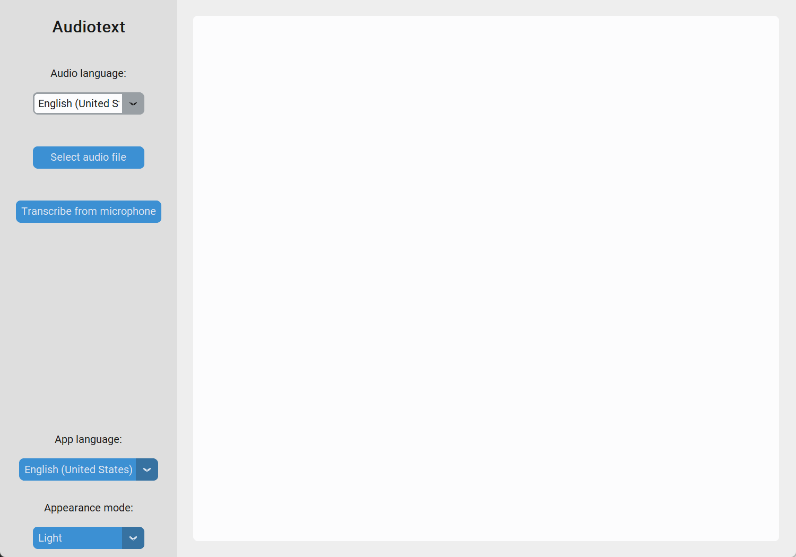

<!-- PROJECT SHIELDS -->
<!--
*** I'm using markdown "reference style" links for readability.
*** Reference links are enclosed in brackets [ ] instead of parentheses ( ).
*** See the bottom of this document for the declaration of the reference variables
*** for contributors-url, forks-url, etc. This is an optional, concise syntax you may use.
*** https://www.markdownguide.org/basic-syntax/#reference-style-links
-->

<!-- PROJECT LOGO -->
 

    
    <h2 align="center">Audiotext</h2>
    

        A program that transcribes audio from a file or microphone to text in any language supported by the Google API.
         
         
        
        
        
        
        
         
         
        <a href="https://github.com/HenestrosaConH/audiotext/issues">Report Bug</a> · <a href="https://github.com/HenestrosaConH/audiotext/issues">Request Feature</a> · <a href="https://github.com/HenestrosaConH/audiotext/discussions">Ask Question</a>
    

<!-- TABLE OF CONTENTS -->

## Table of Contents

- [About The Project](#about-the-project)
    - [Project Structure](#project-structure)
    - [Built With](#built-with)
- [Getting Started](#getting-started)
- [Usage](#usage)
- [Roadmap](#roadmap)
- [Contributing](#contributing)
- [License](#license)
- [Contact](#contact)
- [Acknowledgments](#acknowledgments)

<!-- ABOUT THE PROJECT -->

## About The Project

[![Main screenshot light][demo]](https://github.com/HenestrosaConH/audiotext)

The project is available in Spanish and English. It supports 71 different languages and can take the audio from an audio file, video file or microphone. 
You can also select the theme you like best. It can be dark, light or the one configured in the system.  

<!-- PROJECT STRUCTURE -->

### Project Structure

Directories:
 
- `docs`: Contains files related to the documentation of the project.
- `res`: Contains all the static resources used by the app, which are the app icon (located in the `img` folder) and the i18n files (located in the `locales` folder).
- `src`:  Contains the source code files of the app.

Besides those directories, there are also these two files in the root (apart from the .gitignore, README.md and LICENSE):

- `audiotext.spec`: Used to generate a .exe file with [PyInstaller](https://pyinstaller.org/en/stable/). Notice that, inside the file, there are is the annotation `PATH TO CUSTOMTKINTER`. You will have to replace it by the actual path in your computer. To get it, you can execute `pip show customtkinter`.  
- `requirements.txt`: Lists the names and versions of each package used to build this project. To install the requirements, execute `pip install -r requirements.txt`.
 

(<a href="#top">back to top</a>)

<!-- BUILT WITH -->

### Built With

- [CustomTkinter](https://github.com/TomSchimansky/CustomTkinter)
- [moviepy](https://pypi.org/project/moviepy/)
- [PyAudio](https://pypi.org/project/PyAudio/)
- [pydub](https://github.com/jiaaro/pydub)
- [SpeechRecognition](https://pypi.org/project/SpeechRecognition/)

(<a href="#top">back to top</a>)

<!-- GETTING STARTED -->

## Getting Started

**Important**: You need to install [FFmpeg](https://ffmpeg.org) to execute the program. Otherwise, it won't be able to process the audio files. You can download FFmpeg from the [official site](https://ffmpeg.org/download.html).

If you want to execute the program:
- Go to [releases](https://github.com/HenestrosaConH/audiotext/releases)
- Download the latest release. 
- Uncompress the downloaded file
- Open the `audiotext` folder 
- Open the `audiotext.exe` file 

If you want to open the code:
- Clone the project with the `git clone https://github.com/HenestrosaConH/audiotext.git` command and then open it with your favourite IDE (mine is [PyCharm](https://www.jetbrains.com/pycharm/)).
- Please bear in mind that you cannot generate a single .exe file for this project with PyInstaller due to the dependency with the CustomTkinter package (reason [here](https://github.com/TomSchimansky/CustomTkinter/wiki/Packaging)).
- It's crucial to note that I've had to comment out the line `pprint(response_text, indent=4)` in the `recognize_google` function from the `__init__.py` file of the `SpeechRecognition` package. If it wasn't commented, the project would need to run a command line along with the GUI. Otherwise, the program wouldn't run when calling this function because the mentioned line throws an error that stops the function from running (in case that the program doesn't run on a console), which cannot be handled within the project code.
- Similar to the point above, the lines 159, 160 and 176 of the file `ffmpeg_audiowriter` from the `moviepy` package are commented for the same reason stated above. There is also a change in the line 169. `logger=logger` has been changed to `logger=None` to avoid more errors related to opening the console.
- For Mac M1 users: There is a problem installing the `pyaudio` library. [Here](https://stackoverflow.com/questions/73268630/error-could-not-build-wheels-for-pyaudio-which-is-required-to-install-pyprojec) is a StackOverflow post explaining how to solve this issue.

(<a href="#top">back to top</a>)

<!-- USAGE -->

## Usage

Once you've followed the [getting started](#getting-started) guidelines, you'll see something like this:

![main-system][main-system]

### Select audio file

Click on the `Select audio file` button and select a file from the file explorer. Please note that audio files are selected by default. To select video files, you'll have to click on the combo box in the bottom right corner of the file explorer to change the file type, as indicated in red in the following image.

![file-explorer][file-explorer]

Once you select the file, a green button named `Generate transcription` will show up. Click on it to start generating the transcription.

If there is no error, you'll see the audio transcription in the text box, as shown in the gif above.

Please bear in mind that this process may take some time to complete, depending on the length of the file and whether it is an audio or video file.

### Transcribe from microphone

You just have to click on the `Transcribe from microphone` button and say whatever you want to be transcribed.
Please keep in mind that your Operating System needs to recognize an input source. Otherwise, an error will be shown in the textbox indicating that no microphone was detected.

It's also worth noting that you have 3 seconds to speak from the moment you click the button to the timeout. In case that no input was received, you'll see an error in the screen notifying it.

(<a href="#top">back to top</a>)

### Save transcription

Once the program has generated the transcription, you'll see a green button named `Save transcription` below the text box.

![generated-transcription][generated-transcription]

To save it, you just have to click on the mentioned button. A file explorer will be prompted. You have to give the file a name and select the path where you want to store it. By default, the extension of the file is `.txt`, but you change it to any other file type you want

### Appearance mode

The program supports three appearance modes:

  
System

  

  
Dark

  

  
Light

  

<!-- ROADMAP -->

## Roadmap

- [ ] Add pre-commit config.
- [ ] Add unit tests.
- [ ] Add a percentage to the progress bar.
- [ ] Do a web version with Django/Flask.

You can propose a new feature creating an [issue](https://github.com/HenestrosaConH/audiotext/issues).

(<a href="#readme-top">back to top</a>)

<!-- CONTRIBUTING -->

## Contributing  

Contributions are what make the open source community such an amazing place to learn, inspire, and create. Any contributions you make are **greatly appreciated**.
Please, read the [CONTRIBUTING.md](https://github.com/HenestrosaConH/audiotext/blob/main/.github/CONTRIBUTING.md) file, where you can find more detailed information about how to contribute to the project.

(<a href="#top">back to top</a>)

<!-- LICENSE -->

## License

Distributed under the Creative Commons 1.0 License. See `LICENSE` for more information.

(<a href="#readme-top">back to top</a>)

<!-- CONTACT -->

## Contact

[![LinkedIn][linkedin-shield]][linkedin-url]
[![henestrosaconh@gmail.com][gmail-shield]][gmail-url]

(<a href="#top">back to top</a>)

<!-- ACKNOWLEDGMENTS -->

## Acknowledgments

I've made use of the following resources to make this project:

- [Extracting Speech from Video using Python](https://towardsdatascience.com/extracting-speech-from-video-using-python-f0ec7e312d38)
- [How to Translate Python Applications with the GNU gettext Module](https://phrase.com/blog/posts/translate-python-gnu-gettext/)
- [How to Convert Speech to Text in Python](https://www.thepythoncode.com/article/using-speech-recognition-to-convert-speech-to-text-python)
- [Best-README-Template](https://github.com/othneildrew/Best-README-Template/)
- [Img Shields](https://shields.io)

(<a href="#top">back to top</a>)

<!-- MARKDOWN LINKS & IMAGES -->
<!-- https://www.markdownguide.org/basic-syntax/#reference-style-links -->

[linkedin-url]: https://linkedin.com/in/henestrosaconh
[demo]: docs/demo.gif
[icon]: docs/icon.png
[main-system]: docs/main-system.png
[main-light]: docs/main-light.png
[file-explorer]: docs/file-explorer.png
[generated-transcription]: docs/generated-transcription.png
[linkedin-shield]: https://img.shields.io/badge/LinkedIn-0077B5?style=for-the-badge&logo=linkedin&logoColor=white
[linkedin-url]: https://linkedin.com/in/henestrosaconh
[gmail-shield]: https://img.shields.io/badge/Gmail-D14836?style=for-the-badge&logo=gmail&logoColor=white
[gmail-url]: mailto:henestrosaconh@gmail.com
