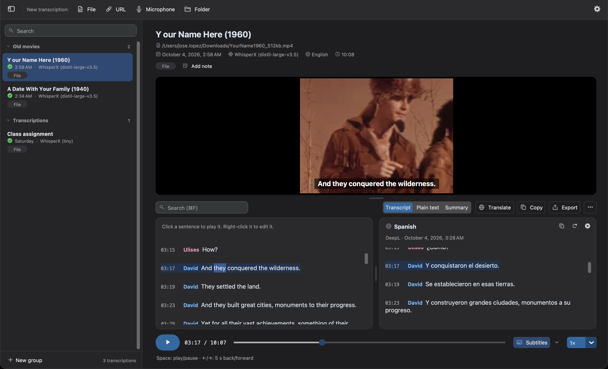

<div id="top"></div>

<!-- PROJECT LOGO -->
<div align="center">
  <picture>
    <source
      srcset="docs/light/icon.png"
      width="128"
      height="128"
      media="(prefers-color-scheme: light)"
    />
    <source
      srcset="docs/dark/icon.png"
      width="128"
      height="128"
      media="(prefers-color-scheme: dark)"
    />
    
  </picture>
  <h1 align="center">Audiotext</h1>
  <p align="center">A desktop app that transcribes audio and video files, YouTube videos and microphone recordings on your computer, and translates, summarizes and subtitles them.</p>
  <p>
    <a href="https://github.com/HenestrosaDev/audiotext/actions/workflows/code-quality.yml">
      
    </a>
    <a href="https://github.com/HenestrosaDev/audiotext/actions/workflows/build.yml">
      
    </a>
    <br>
    <a href="https://github.com/HenestrosaDev/audiotext/releases/latest">
      
    </a>
    <a href="https://github.com/HenestrosaDev/audiotext/stargazers">
      
    </a>
    <a href="https://github.com/HenestrosaDev/audiotext/blob/main/LICENSE">
      
    </a>
    <br>
    <a href="https://github.com/HenestrosaDev/audiotext/graphs/contributors">
      
    </a>
    <a href="https://github.com/HenestrosaDev/audiotext/issues">
      
    </a>
    <a href="https://github.com/HenestrosaDev/audiotext/pulls">
      
    </a>
  </p>
  <p>
    <a href="https://getaudiotext.com">
      <strong>Documentation</strong>
    </a>
    ·
    <a href="https://github.com/HenestrosaDev/audiotext/issues/new/choose">
      Report Bug
    </a>
    ·
    <a href="https://github.com/HenestrosaDev/audiotext/issues/new/choose">
      Request Feature
    </a>
    ·
    <a href="https://github.com/HenestrosaDev/audiotext/discussions">
      Ask Question
    </a>
  </p>
</div>

<picture>
  <source
    srcset="docs/light/main.png"
    media="(prefers-color-scheme: light)"
  />
  <source
    srcset="docs/dark/main.png"
    width="128"
    height="128"
    media="(prefers-color-scheme: dark)"
  />
  
</picture>

<!-- TABLE OF CONTENTS -->

## Table of Contents

- [About the Project](#about-the-project)
  - [Features](#features)
  - [Documentation](#documentation)
  - [Supported Languages](#supported-languages)
  - [Supported File Types](#supported-file-types)
  - [Project Structure](#project-structure)
  - [Built With](#built-with)
- [Getting Started](#getting-started)
  - [Installation](#installation)
  - [Setting Up the Project Locally](#setting-up-the-project-locally)
  - [Notes](#notes)
- [Usage](#usage)
  - [The Window](#the-window)
  - [Audio Sources](#audio-sources)
  - [Transcription Settings](#transcription-settings)
  - [Transcription Engines](#transcription-engines)
  - [The Transcript](#the-transcript)
  - [Summary and Translation](#summary-and-translation)
  - [Export](#export)
  - [History](#history)
  - [Preferences](#preferences)
  - [Keyboard Shortcuts](#keyboard-shortcuts)
  - [Command-Line Interface](#command-line-interface)
- [Troubleshooting](#troubleshooting)
- [Roadmap](#roadmap)
- [Authors](#authors)
- [Contributing](#contributing)
  - [Translations](#translations)
  - [Documentation Website](#documentation-website)
  - [Releasing a Version](#releasing-a-version)
- [Acknowledgments](#acknowledgments)
- [License](#license)
- [Support](#support)

<!-- ABOUT THE PROJECT -->

## About the Project

**Audiotext** transcribes the audio of files, videos, YouTube videos, links to media files, microphone recordings and whole folders into any of the 100 languages it supports. It transcribes with [**WhisperX**](https://github.com/m-bain/whisperX) on your computer, for free and without sending your audio anywhere, or with the [**Whisper API**](https://platform.openai.com/docs/guides/speech-to-text) and the [**Google Speech-to-Text API**](https://cloud.google.com/speech-to-text). Then you can play the transcription sentence by sentence, correct it, translate it, summarize it and export it, for example as subtitles.

### Features

- **Any source**: audio and video files, YouTube videos and direct links to media files, the microphone (with a live draft of the text while you speak), the files of a folder and its subfolders, or a folder that is watched to transcribe the files added to it.
- **Private and offline**: WhisperX runs on your computer, on the CPU or, much faster, on an NVIDIA GPU with CUDA.
- **Speaker identification**, word-level timings, speech extraction (to reduce music and background noise), and keywords and context to spell names and terms right.
- **Translation while transcribing**, with Whisper, or afterwards with OpenAI, Claude, Gemini, DeepSeek, Mistral, Grok, Ollama, DeepL or Google Translate.
- **A transcript you can play**: click a sentence to play it, change the speed, search the text, watch videos with their subtitles, rename the speakers and correct the text while keeping the timestamps.
- **Summaries** with the key points and the chapters of the transcription.
- **Export** to plain text, Markdown, Word, SRT, VTT, TSV and JSON.
- **History** of all your transcriptions, with search, groups, pins, tags and notes, and a queue to transcribe while you keep working, with a notification when each transcription is ready (or, in a watched folder, each new file).
- **Command-line interface** to transcribe from scripts.
- **The interface in 22 languages**, with a light, dark or system theme.

### Documentation

The full documentation of **Audiotext** is available at [**getaudiotext.com**](https://getaudiotext.com), in all the languages of the interface (Català, Čeština, Deutsch, English, Español, Français, Galego, हिन्दी, Bahasa Indonesia, Italiano, 日本語, 한국어, Nederlands, Polski, Português, Română, Русский, Svenska, Türkçe, Українська, Tiếng Việt and 简体中文). The website opens in the language of your browser, and the app opens it in the language of its interface from `Preferences` → `About` → `Documentation`.

<!-- SUPPORTED LANGUAGES -->

### Supported Languages

WhisperX and the Whisper API transcribe these languages, and detect them automatically:

<details>
  <summary>Click here to display</summary>

  - Afrikaans
  - Albanian
  - Amharic
  - Arabic
  - Armenian
  - Assamese
  - Azerbaijan
  - Bashkir
  - Basque
  - Belarusian
  - Bengali
  - Bosnian
  - Breton
  - Bulgarian
  - Burmese
  - Catalan
  - Chinese
  - Chinese (Yue)
  - Croatian
  - Czech
  - Danish
  - Dutch
  - English
  - Estonian
  - Faroese
  - Farsi
  - Finnish
  - French
  - Galician
  - Georgian
  - German
  - Greek
  - Gujarati
  - Haitian
  - Hausa
  - Hawaiian
  - Hebrew
  - Hindi
  - Hungarian
  - Icelandic
  - Indonesian
  - Italian
  - Japanese
  - Javanese
  - Kannada
  - Kazakh
  - Khmer
  - Korean
  - Lao
  - Latin
  - Latvian
  - Lingala
  - Lithuanian
  - Luxembourgish
  - Macedonian
  - Malagasy
  - Malay
  - Malayalam
  - Maltese
  - Maori
  - Marathi
  - Mongolian
  - Nepali
  - Norwegian
  - Norwegian Nynorsk
  - Occitan
  - Pashto
  - Polish
  - Português
  - Punjabi
  - Romanian
  - Russian
  - Sanskrit
  - Serbian
  - Shona
  - Sindhi
  - Sinhala
  - Slovak
  - Slovenian
  - Somali
  - Spanish
  - Sundanese
  - Swahili
  - Swedish
  - Tagalog
  - Tajik
  - Tamil
  - Tatar
  - Telugu
  - Thai
  - Tibetan
  - Turkish
  - Turkmen
  - Ukrainian
  - Urdu
  - Uzbek
  - Vietnamese
  - Welsh
  - Yiddish
  - Yoruba
</details>

The interface is available in Català, Čeština, Deutsch, English, Español, Français, Galego, हिन्दी, Bahasa Indonesia, Italiano, 日本語, 한국어, Nederlands, Polski, Português, Română, Русский, Svenska, Türkçe, Українська, Tiếng Việt and 简体中文. It uses the language of the system if it's available, and it can be changed in `Preferences` → `General` → `Interface language`.

<!-- SUPPORTED FILE TYPES -->

### Supported File Types

<details>
  <summary>Audio file formats</summary>

  - `.aac`
  - `.flac`
  - `.mp3`
  - `.mpeg`
  - `.oga`
  - `.ogg`
  - `.opus`
  - `.wav`
  - `.wma`
</details>

<details>
  <summary>Video file formats</summary>

  - `.3g2`
  - `.3gp2`
  - `.3gp`
  - `.3gpp2`
  - `.3gpp`
  - `.asf`
  - `.avi`
  - `.f4a`
  - `.f4b`
  - `.f4v`
  - `.flv`
  - `.m4a`
  - `.m4b`
  - `.m4r`
  - `.m4v`
  - `.mkv`
  - `.mov`
  - `.mp4`
  - `.ogv`
  - `.ogx`
  - `.webm`
  - `.wmv`
</details>

<!-- PROJECT STRUCTURE -->

### Project Structure

<details>
  <summary>ASCII folder structure</summary>

  ```
  │   .env.example
  │   .gitignore
  │   .pre-commit-config.yaml
  │   audiotext.spec
  │   config.ini
  │   LICENSE
  │   pyproject.toml
  │   README.md
  │   requirements-dev.txt
  │   requirements.txt
  │
  ├───.github
  │   │   CONTRIBUTING.md
  │   │   dependabot.yml
  │   │   FUNDING.yml
  │   │
  │   ├───ISSUE_TEMPLATE
  │   │       bug_report_template.md
  │   │       feature_request_template.md
  │   │
  │   ├───PULL_REQUEST_TEMPLATE
  │   │       pull_request_template.md
  │   │
  │   ├───scripts
  │   │       build_bundle.sh
  │   │       compile_translations.py
  │   │       make_gpu_addon.py
  │   │       smoke_test_app.py
  │   │       update_translations.py
  │   │       use_cpu_torch.py
  │   │
  │   └───workflows
  │           build.yml
  │           code-quality.yml
  │           release.yml
  │           web.yml
  │
  ├───docs/ (images of this README)
  │
  ├───packaging
  │       linux-install.sh
  │       linux.sh
  │       macos.sh
  │       windows.iss
  │
  ├───res
  │   ├───img
  │   │       file-explorer.png
  │   │       icon-dark.png
  │   │       icon-light.png
  │   │
  │   ├───locales
  │   │   │   audiotext.pot
  │   │   │
  │   │   └───<language>
  │   │       └───LC_MESSAGES
  │   │               audiotext.mo
  │   │               audiotext.po
  │   │
  │   ├───macos
  │   │       entitlements.plist
  │   │       icon.icns
  │   │
  │   └───windows
  │           icon.ico
  │
  ├───src
  │   │   app.py
  │   │   cli.py
  │   │
  │   ├───controllers
  │   │       __init__.py
  │   │       directory_report.py
  │   │       folder_transcriber.py
  │   │       main_controller.py
  │   │       mic_recorder.py
  │   │       transcription_saver.py
  │   │       transcription_validator.py
  │   │
  │   ├───handlers
  │   │       __init__.py
  │   │       ai_providers.py
  │   │       audio_handler.py
  │   │       google_api_handler.py
  │   │       live_transcriber.py
  │   │       openai_api_handler.py
  │   │       summary_handler.py
  │   │       transcribers.py
  │   │       translation_handler.py
  │   │       url_handler.py
  │   │       whisperx_handler.py
  │   │       youtube_handler.py
  │   │
  │   ├───interfaces
  │   │       __init__.py
  │   │       transcribable.py
  │   │       transcriber.py
  │   │       transcription_view.py
  │   │
  │   ├───models
  │   │   │   __init__.py
  │   │   │   history.py
  │   │   │   summary.py
  │   │   │   transcript_segment.py
  │   │   │   transcription.py
  │   │   │   transcription_settings.py
  │   │   │   translation.py
  │   │   │
  │   │   └───config
  │   │           __init__.py
  │   │           config_ai.py
  │   │           config_subtitles.py
  │   │           config_system.py
  │   │           config_transcription.py
  │   │           config_whisper_api.py
  │   │           config_whisperx.py
  │   │
  │   ├───utils
  │   │       __init__.py
  │   │       audio_player.py
  │   │       audio_utils.py
  │   │       cancellation.py
  │   │       config_manager.py
  │   │       constants.py
  │   │       enums.py
  │   │       env_keys.py
  │   │       errors.py
  │   │       exporters.py
  │   │       folder_watcher.py
  │   │       history_store.py
  │   │       i18n.py
  │   │       media.py
  │   │       notifications.py
  │   │       path_helper.py
  │   │       progress.py
  │   │       subtitle_cues.py
  │   │       system.py
  │   │       time_format.py
  │   │       transcript_editing.py
  │   │       validators.py
  │   │
  │   └───views
  │       │   __init__.py
  │       │
  │       ├───entries
  │       │       __init__.py
  │       │       delegates.py
  │       │       entry_header.py
  │       │       folder_view.py
  │       │       progress_card.py
  │       │       status_view.py
  │       │
  │       ├───history
  │       │       __init__.py
  │       │       formatting.py
  │       │       history_row.py
  │       │       history_sidebar.py
  │       │
  │       ├───main_window
  │       │       __init__.py
  │       │       entry_actions.py
  │       │       main_window.py
  │       │       top_bar.py
  │       │       transcription_jobs.py
  │       │       welcome_view.py
  │       │
  │       ├───new_transcription
  │       │       __init__.py
  │       │       microphone_view.py
  │       │       new_transcription_view.py
  │       │
  │       ├───settings
  │       │   │   __init__.py
  │       │   │   option_labels.py
  │       │   │   preferences_dialog.py
  │       │   │   settings_form.py
  │       │   │
  │       │   └───cards
  │       │           __init__.py
  │       │           base.py
  │       │           context_card.py
  │       │           engine_card.py
  │       │           folder_card.py
  │       │           language_card.py
  │       │           live_card.py
  │       │           options_card.py
  │       │           output_card.py
  │       │
  │       ├───style
  │       │       __init__.py
  │       │       icons.py
  │       │       theme.py
  │       │
  │       ├───transcript
  │       │       __init__.py
  │       │       corrections.py
  │       │       edit_dialogs.py
  │       │       media_layout.py
  │       │       player_bar.py
  │       │       summary_panel.py
  │       │       transcript_text.py
  │       │       transcript_view.py
  │       │       translation_panel.py
  │       │       video_pane.py
  │       │
  │       └───widgets
  │               __init__.py
  │               bindings.py
  │               button.py
  │               level_meter.py
  │               option_menu.py
  │               pill.py
  │               search_entry.py
  │               searchable_option_menu.py
  │               splitter.py
  │               stepper.py
  │               text_dialog.py
  │               textbox.py
  │
  └───tests/ (the test suite (pytest))
  ```
</details>

<!-- BUILT WITH -->

### Built With

- [CustomTkinter](https://github.com/TomSchimansky/CustomTkinter) for the interface, and [tkinterdnd2](https://github.com/Eliav2/tkinterdnd2) for dropping files and folders on the window.
- [WhisperX](https://github.com/m-bain/whisperX) for fast automatic speech recognition on your computer. This product includes software developed by Max Bain. Uses [faster-whisper](https://github.com/SYSTRAN/faster-whisper), which is a reimplementation of [OpenAI's Whisper](https://github.com/openai/whisper) model using [CTranslate2](https://github.com/OpenNMT/CTranslate2/), and [pyannote.audio](https://github.com/pyannote/pyannote-audio) to identify the speakers.
- [PyTorch](https://github.com/pytorch/pytorch) and [Torchaudio](https://pytorch.org/audio/stable/index.html), which WhisperX runs on, with [CUDA](https://pytorch.org/docs/stable/cuda.html) for NVIDIA GPUs.
- [OpenAI Python API library](https://pypi.org/project/openai/) for the **Whisper API**, and for the summaries and translations with OpenAI, DeepSeek, Gemini, Mistral, Grok and Ollama.
- [Anthropic Python API library](https://pypi.org/project/anthropic/) for the summaries and translations with Claude.
- [SpeechRecognition](https://pypi.org/project/SpeechRecognition/) for the **Google Speech-to-Text API**.
- [FFmpeg](https://ffmpeg.org/) and [pydub](https://github.com/jiaaro/pydub) to extract and process the audio of the files.
- [python-sounddevice](https://github.com/spatialaudio/python-sounddevice) to record from the microphone and play the audio of the transcriptions.
- [pytubefix](https://github.com/JuanBindez/pytubefix) to download the audio of YouTube videos.
- [python-docx](https://github.com/python-openxml/python-docx) to export Word documents.
- [Babel](https://babel.pocoo.org/) for the translations of the interface and the names of the languages.
- [keyring](https://github.com/jaraco/keyring) to keep the API keys in the credential store of the system, and [python-dotenv](https://pypi.org/project/python-dotenv/) to read them from `.env` files.
- [Astro Starlight](https://starlight.astro.build) for the [documentation website](https://getaudiotext.com).

<p align="right">(<a href="#top">back to top</a>)</p>

<!-- GETTING STARTED -->

## Getting Started

### Installation

Download the file for your system from the [latest release](https://github.com/HenestrosaDev/audiotext/releases/latest). FFmpeg is included, so you don't need to install anything else.

| System | File |
| --- | --- |
| macOS 15 or later (Apple Silicon) | `Audiotext-X.Y.Z-macos-arm64.dmg` |
| Windows (64-bit) | `Audiotext-X.Y.Z-windows-x64-setup.exe` |
| Linux (x86_64) | `Audiotext-X.Y.Z-linux-x86_64.tar.gz` |

The `-gpu-N` files are downloaded by the installers if you choose GPU acceleration, so you don't need to download them yourself.

- **macOS**: Open the `.dmg` file and drag `Audiotext` into the `Applications` folder. The app isn't notarized by Apple, so the first time you open it, macOS will block it. To open it anyway, go to `System Settings` > `Privacy & Security` and click `Open Anyway`. Intel Macs aren't supported because PyTorch no longer supports them.
- **Windows**: Run the installer. If you have an NVIDIA GPU, the installer offers to download GPU acceleration (CUDA), which makes WhisperX transcriptions much faster. The installer isn't signed, so Windows SmartScreen may warn you about it: click `More info` > `Run anyway`.
- **Linux**: Extract the archive and run `./install.sh`. It installs the app for your user and adds it to the applications menu. If you have an NVIDIA GPU, it offers to download GPU acceleration (CUDA); you can also choose it with `./install.sh --gpu` or `./install.sh --cpu`. To uninstall the app, run `./install.sh --uninstall`. You can also run the app without installing it by opening `Audiotext/Audiotext`, but only with the CPU. To record from the microphone and play audio, install PortAudio (e.g. `sudo apt install libportaudio2`).

To change between the CPU and the GPU versions, install the app again and choose the other option.

The [installation guide](https://getaudiotext.com/en/getting-started/installation/) explains these steps in detail.

### Setting Up the Project Locally

1. Install the system dependencies: [FFmpeg](https://ffmpeg.org) (required to process audio and video files) and, on Linux, [PortAudio](https://www.portaudio.com/) (required to record from the microphone and play audio; on macOS and Windows, it's included in the `sounddevice` package):
   ```bash
   # macOS
   brew install ffmpeg
   # Ubuntu/Debian
   sudo apt install ffmpeg libportaudio2
   # Windows
   choco install ffmpeg
   ```
2. Clone the repository by running `git clone https://github.com/HenestrosaDev/audiotext.git` and change the current working directory to `audiotext` by running `cd audiotext`.
3. (Optional but recommended) Create a Python virtual environment in the project root. If you're using `virtualenv`, you would run `virtualenv venv`. **Python 3.10 to 3.13** is required (WhisperX doesn't support Python 3.14 yet).
4. (Optional but recommended) Activate the virtual environment:
   ```bash
   # on Windows
   . venv/Scripts/activate
   # if you get the error `FullyQualifiedErrorId : UnauthorizedAccess`, run this:
   Set-ExecutionPolicy Unrestricted -Scope Process
   # and then . venv/Scripts/activate

   # on macOS and Linux
   source venv/bin/activate
   ```
5. Run `pip install -r requirements.txt` to install the dependencies.
   - `requirements.txt` installs PyTorch with CUDA support, which is a large download (several GB) on Linux and Windows. If you don't have an NVIDIA GPU, install the CPU-only build first by running `pip install torch==2.8.0 torchaudio==2.8.0 torchvision==0.23.0 --index-url https://download.pytorch.org/whl/cpu`. On macOS, there's no CUDA, so the CPU build is always used.
   - If you use [uv](https://docs.astral.sh/uv/) instead of pip, run `uv pip install --index-strategy unsafe-best-match -r requirements.txt`, since uv only looks for a package in the first index that has it by default.
6. (Optional) If you intend to contribute to the project, run `pip install -r requirements-dev.txt` to install the development dependencies.
7. (Optional) If you followed step 6, run `pre-commit install` to install the pre-commit hooks in your `.git/` directory.
8. (Optional) The API keys can be set from the app. To set them beforehand, copy the `.env.example` file as `.env` to your user configuration folder (see the notes below) and fill them in. They can also be set as environment variables.
9. Run `python src/app.py` to start the program. The first time a **WhisperX** model is used, it's downloaded (from ~75 MB for `tiny` to ~3 GB for `large-v2`), so it may take a while. To try the program quickly, choose the `tiny` model in the `Engine` settings of the transcription.
10. (Optional) If you followed step 6, run `pytest` to run the test suite.

### Notes

- The `config.ini` file of the project contains the default settings and is never modified by the app. The settings you change, the history of the transcriptions and the recordings of the microphone are stored in your user configuration folder, so they survive updates and are not committed by mistake:
  - **Windows**: `%APPDATA%\Audiotext`
  - **macOS**: `~/Library/Application Support/Audiotext`
  - **Linux**: `~/.config/audiotext` (or `$XDG_CONFIG_HOME/audiotext`)

  It contains `config.ini` (your settings; delete it to restore the defaults), `history.json` (your transcriptions, with their summaries, translations and corrections) and `media/` (the recordings and the audio downloaded from links). To use another folder (e.g. for a portable installation), set the `AUDIOTEXT_CONFIG_DIR` environment variable.
- The API keys and the Hugging Face token are kept in the credential store of your system: the Keychain on macOS, the Credential Manager on Windows and the Secret Service (e.g. GNOME Keyring or KWallet) on Linux. If the system has none (e.g. a server without a desktop), they're stored in a `.env` file in the same folder, readable only by your user. The keys that previous versions stored in that file are moved to the credential store the first time the app opens. Environment variables with the same names (`OPENAI_API_KEY`, `ANTHROPIC_API_KEY`, `DEEPSEEK_API_KEY`, `GEMINI_API_KEY`, `MISTRAL_API_KEY`, `XAI_API_KEY`, `DEEPL_API_KEY`, `GOOGLE_API_KEY` and `HF_TOKEN`) take precedence, and a `.env` file in the root of the project, used by previous versions, is still read.
- I had to comment out the lines `pprint(response_text, indent=4)` in the `recognize_google` function from the `__init__.py` file of the `SpeechRecognition` package to avoid opening a command line along with the GUI. Otherwise, the program would not be able to use the Google API transcription method because `pprint` throws an error if it cannot print to the CLI, preventing the code from generating the transcription.

<p align="right">(<a href="#top">back to top</a>)</p>

<!-- USAGE -->

## Usage

This is an overview of what you can do with **Audiotext**. The [documentation](https://getaudiotext.com) explains each feature in detail.

### The Window

- **The top bar** has the buttons to start a new transcription from a `File`, a `URL`, the `Microphone` or a `Folder`, the status of the app, and the gear that opens the [preferences](#preferences). The button on the left shows or hides the history.
- **The history**, on the left, has all your transcriptions (see [History](#history)).
- **The main area** shows the source you're setting up, the progress of a transcription, or the transcription selected in the history.

You can also drop a file or a folder anywhere on the window to transcribe it. See [your first transcription](https://getaudiotext.com/en/getting-started/first-transcription/).

### Audio Sources

- **File**: an audio or video file (see the [supported file types](#supported-file-types)).
- **URL**: a YouTube video or a direct link to an audio or video file, e.g. the episode of a podcast. The audio is downloaded first.
- **Microphone**: records you or a meeting and transcribes it. The recording is kept in the history. With WhisperX, `Show the text while recording` shows a draft written by a fast model while you speak, which is replaced by the transcription of the whole recording when you stop.
- **Folder**: transcribes the audio and video files of a folder and its subfolders, and saves the transcription of each file next to it (or in another folder) in the chosen file types. Files that already have a transcription are skipped unless `Overwrite existing files` is on. With `Watch the folder`, it keeps transcribing the files added to the folder until you stop it.

While a transcription is in progress, you can keep using the app and set up the next ones, which are added to a queue. See [audio sources](https://getaudiotext.com/en/guides/sources/).

### Transcription Settings

Before transcribing, the settings are shown in cards. They're remembered for the next time, and each transcription keeps the settings it was made with:

- **Engine**: the transcription method and its model (see [Transcription Engines](#transcription-engines)).
- **Language**: the language of the audio (detected automatically by default) and the language of the transcription. If they differ, Whisper translates the audio while transcribing: into English, or, experimentally, into any other language.
- **Context**: `Keywords` (names, terms or acronyms said in the audio, so they're spelled right) and a `Description` of what the audio is about.
- **Options**: `Word-level timings` (to highlight each word while playing), `Extract speech` (to reduce music and background noise) and `Identify speakers`. Identifying the speakers with WhisperX requires a free Hugging Face token and accepting the conditions of [pyannote/speaker-diarization-community-1](https://huggingface.co/pyannote/speaker-diarization-community-1).
- **Live text** (microphone) and **Folder** and **Output** (folders).

See [transcription settings](https://getaudiotext.com/en/guides/transcription-settings/).

### Transcription Engines

| | WhisperX | Whisper API | Google API |
| --- | --- | --- | --- |
| Runs on | Your computer | OpenAI servers | Google servers |
| Cost | Free, unlimited | Paid, requires an OpenAI API key | Free tier (60 minutes per month), or paid with an API key |
| Detects the language and translates | ✓ | ✓ | |
| Timestamps | ✓ | With `whisper-1` and `gpt-4o-transcribe-diarize` | |
| Identifies the speakers | ✓ (with a Hugging Face token) | With `gpt-4o-transcribe-diarize` | |

- **WhisperX** is the default. Its models go from `tiny` (~1 GB of VRAM, fast) to `large-v2` (the default, <8 GB, the most accurate) and `large-v3-turbo` (much faster, almost as accurate). The English-only models (`tiny.en`, `base.en`, `small.en`, `medium.en`) and the distilled ones (`distil-small.en`, `distil-medium.en`, `distil-large-v2`, `distil-large-v3`, `distil-large-v3.5`) are faster than the multilingual models of the same size, but only transcribe English. The `Compute type`, the `Batch size` and the `Use CPU` options are in the preferences.
- **Whisper API**: `whisper-1` (the default) has timestamps and translates into English, `gpt-transcribe` is more accurate but has no timestamps, and `gpt-4o-transcribe-diarize` identifies the speakers. Long audios are split into chunks of up to 10 minutes.
- **Google API**: doesn't punctuate the sentences (Audiotext does), can't detect the language nor translate, and returns plain text.

See [engines](https://getaudiotext.com/en/reference/engines/).

### The Transcript

Select a transcription of the history to open it. It has three modes:

- **Transcript**: each sentence with its timestamp and its speaker. Click a sentence to play the audio from there, change the speed from `0.5×` to `2×`, and search the text with `Ctrl+F` (`⌘F` on macOS). Videos are shown above the text, with their subtitles.
- **Plain text**: the text, which you can edit freely. The changes are saved automatically.
- **Summary**: see [Summary and Translation](#summary-and-translation).

To correct the transcription while keeping its timestamps, use `Find and replace…`, `Rename speakers…` (giving two speakers the same name merges them) or right-click a sentence to edit it. See [the transcript](https://getaudiotext.com/en/guides/transcript/).

### Summary and Translation

The `Summary` mode generates a summary of the transcription, its key points and, if it has timestamps, its chapters. The `Translate` button translates it into another language, shown next to the original text and sentence by sentence, so the translation is also played and highlighted. Both are kept in the history.

<picture>
  <source
    srcset="docs/light/summary.png"
    media="(prefers-color-scheme: light)"
  />
  <source
    srcset="docs/dark/summary.png"
    width="128"
    height="128"
    media="(prefers-color-scheme: dark)"
  />
  
</picture>

They're generated by the provider chosen in `Preferences` → `AI`:

| Provider | Default model | API key |
| --- | --- | --- |
| OpenAI | `gpt-5.4-mini` | [OpenAI](https://platform.openai.com/api-keys) |
| Claude (Anthropic) | `claude-haiku-4-5` | [Anthropic](https://console.anthropic.com/settings/keys) |
| DeepSeek | `deepseek-chat` | [DeepSeek](https://platform.deepseek.com/api_keys) |
| Gemini (Google) | `gemini-3.8-flash` | [Google AI Studio](https://aistudio.google.com/apikey) |
| Mistral | `mistral-small-latest` | [Mistral](https://console.mistral.ai/api-keys) |
| Grok (xAI) | `grok-4.3` | [xAI](https://console.x.ai) |
| Ollama (local) | `llama3.2` | Not needed. The models run on your computer with [Ollama](https://ollama.com) |

Leave the model empty to use the default one of the provider, or type the name of any other model of the provider. The translations can also be made by **DeepL** (with a [DeepL API key](https://www.deepl.com/your-account/keys), including the free ones) and **Google Translate** (with the Google API key and the Cloud Translation API enabled). Each provider charges for the use of its API, for which **Audiotext** is not responsible. See [summary and translation](https://getaudiotext.com/en/guides/summary-and-translation/).

### Export

The `Export` button (or `Ctrl+S`, `⌘S` on macOS) saves the transcription as plain text (`.txt`), Markdown (`.md`), a Word document (`.docx`), subtitles (`.srt` and `.vtt`), a table (`.tsv`) or JSON (`.json`). The Markdown and Word documents include the summary, if any, and the text in paragraphs with the timestamp and the speaker of each one. When transcribing a folder, the files are saved automatically in the chosen types.

### History

Every transcription is kept in the history, with its summary, its translation and its corrections. Search them by name, text, note, tag or source, and right-click one to rename it, add a note or a tag, pin it to the top, move it to a group, show its file in the file manager or delete it. Deleting a transcription doesn't delete your audio, video or saved files. See [history](https://getaudiotext.com/en/guides/history/).

### Preferences

The gear at the top right opens the settings that don't change with each transcription:

- **General**: the appearance (system, light or dark), the interface language and the notifications of the system when a transcription is ready.
- **AI**: the providers and the models of the summaries and the translations, and the address of Ollama.
- **API keys**: the keys of OpenAI, Anthropic, DeepSeek, Gemini, Mistral, xAI, DeepL and Google, and the Hugging Face token.
- **WhisperX**: the compute type, the batch size and whether to use the CPU.
- **Subtitles**: highlighting the words, and the maximum line count and width of the `.srt` and `.vtt` files.
- **Whisper API**: the temperature and the timestamps of the words.
- **About**: the version, and links to the documentation, GitHub and the donation page.

See [preferences](https://getaudiotext.com/en/reference/preferences/).

### Keyboard Shortcuts

| Shortcut | Action |
| --- | --- |
| `Ctrl+Enter` / `⌘↩` | Start the transcription, or start and stop recording |
| `Ctrl+O` / `⌘O` | Choose a file (or a folder, in the folder source) |
| `Ctrl+S` / `⌘S` | Export the transcription being shown |
| `Ctrl+F` / `⌘F` | Search the transcription |
| `Esc` | Cancel the transcription in progress |
| `Space` | Play or pause the audio |
| `←` / `→` | Go back or forward 5 seconds |

### Command-Line Interface

**Audiotext** can also be used from the command line to transcribe from scripts, when [running it from the source code](#setting-up-the-project-locally). The options that are not given take the values configured in the app, and the transcriptions are always saved next to each transcribed file, or in the folder given with `--output-dir` (where the subfolders of a transcribed folder are recreated).

```bash
# Transcribe a file. The text is also printed, so it can be redirected
python src/cli.py transcribe interview.mp3 --language es --output-types txt,srt

# Transcribe the files of a folder identifying the speakers
python src/cli.py transcribe recordings/ --diarize --speakers 2 --output-dir transcriptions/

# Transcribe a YouTube video with the Whisper API
python src/cli.py transcribe "https://www.youtube.com/watch?v=…" --method whisper-api

# Transcribe a meeting with the Whisper API, with its keywords and its context
python src/cli.py transcribe meeting.m4a --method whisper-api \
    --openai-model gpt-transcribe --keywords "Audiotext, WhisperX" \
    --prompt "A meeting about the next release"

# Transcribe the files added to a folder until stopped with Ctrl+C
python src/cli.py watch inbox/ --output-types srt

# Check whether a new version is available
python src/cli.py check-update
```

Run `python src/cli.py transcribe --help` to see all the options. The progress is printed to the standard error (use `--quiet` to hide it, or `--verbose` to also print the logs), and the command exits with code `1` if a transcription fails. For the speaker identification, the Hugging Face token can be set in the app or in the `HF_TOKEN` environment variable. See [the command-line interface](https://getaudiotext.com/en/reference/cli/).

<p align="right">(<a href="#top">back to top</a>)</p>

<!-- TROUBLESHOOTING -->

## Troubleshooting

- **The first WhisperX transcription takes a long time**: the model is downloaded the first time it's used (up to ~3 GB). It stays in memory while its options don't change, so the next transcriptions start right away.
- **WhisperX fails with `CUDA out of memory`**: lower the `Batch size` (e.g. `4`) in `Preferences` → `WhisperX`, use a smaller model (e.g. `small`) or a lighter `Compute type` (e.g. `int8`). The last two can reduce the quality.
- **Transcribing takes too long**: the speed of WhisperX depends on your hardware. Try a smaller model, `large-v3-turbo` on a GPU, or the Whisper API or the Google API, which run on remote servers.
- **The Whisper API returns the error `429`**: your OpenAI account has run out of credits, or it needs funds before using the API for the first time. Buy credits in the [Billing](https://platform.openai.com/settings/organization/billing/overview) section of your account, wait up to 10 minutes and, if the error persists, create a new API key.
- **The speakers aren't identified**: check that the Hugging Face token has the `Read` role and that you've accepted the conditions of [pyannote/speaker-diarization-community-1](https://huggingface.co/pyannote/speaker-diarization-community-1) with the same account.

See [troubleshooting](https://getaudiotext.com/en/help/troubleshooting/) for more problems and their solutions.

<!-- ROADMAP -->

## Roadmap

See the [project backlog](https://github.com/users/HenestrosaDev/projects/1).

You can propose a new feature by creating a [discussion](https://github.com/HenestrosaDev/audiotext/discussions/new?category=ideas)!

<!-- AUTHORS -->

## Authors

- HenestrosaDev <henestrosadev@gmail.com> (José Carlos López Henestrosa)

See also the list of [contributors](https://github.com/HenestrosaDev/audiotext/contributors) who participated in this project.

<!-- CONTRIBUTING -->

## Contributing

Contributions are what make the open source community such an amazing place to learn, inspire, and create. Any contributions you make are **greatly appreciated**. Please read the [CONTRIBUTING.md](https://github.com/HenestrosaDev/audiotext/blob/main/.github/CONTRIBUTING.md) file, where you can find more detailed information about how to contribute to the project.

### Translations

The interface is translated with [gettext](https://www.gnu.org/software/gettext/). The texts marked with `_()` (or `N_()`, for the ones defined before the language is set) are in `res/locales/audiotext.pot`, and the translations of each language in `res/locales/<language>/LC_MESSAGES/audiotext.po`, which are compiled into the `audiotext.mo` files that the app loads.

After the texts of the code change, or after editing a `.po` file (e.g. with [Poedit](https://poedit.net/)), run:

```bash
python .github/scripts/update_translations.py
```

It extracts the texts into the template, updates the catalogs, compiles them and lists the texts that are still to translate or review (new texts are empty, and changed ones are marked as `fuzzy`). Those are shown in English until they're translated and their `fuzzy` flag is removed. The tests (`tests/test_translations.py`) fail while a catalog is out of date or a translation doesn't keep the placeholders of the original text (e.g. `{count}`).

To add a language, create its catalog, add it to `UI_LANGUAGES` in `src/utils/i18n.py`, translate it and run the script:

```bash
pybabel init -i res/locales/audiotext.pot -d res/locales -D audiotext -l <code>
python .github/scripts/update_translations.py
```

### Documentation Website

The source of [getaudiotext.com](https://getaudiotext.com) is in the [audiotext-docs](https://github.com/HenestrosaDev/audiotext-docs) repository. It's built with [Astro Starlight](https://starlight.astro.build) and requires [Node.js](https://nodejs.org) 22.12 or later. Each language has its own folder in `src/content/docs` (e.g. `en`, `es` or `zh-cn`), and the root of the website redirects to the language of the browser, or to English.

```bash
git clone https://github.com/HenestrosaDev/audiotext-docs.git
cd audiotext-docs
npm install
npm run dev     # serves the website at http://localhost:4321
npm run build   # builds the website into dist
```

When a feature changes, update the English page and its translations. A page that hasn't been translated yet is shown in English, with a notice, in the other languages.

### Releasing a Version

See [Releasing a Version](https://github.com/HenestrosaDev/audiotext/blob/main/.github/CONTRIBUTING.md#releasing-a-version) in the contributing guide.

<!-- ACKNOWLEDGMENTS -->

## Acknowledgments

I used the following resources to create this project:

- [Buzz](https://github.com/chidiwilliams/buzz), which inspired the folder watching, the transcript viewer, the speaker identification and the command-line interface.
- [Extracting speech from video using Python](https://towardsdatascience.com/extracting-speech-from-video-using-python-f0ec7e312d38)
- [How to translate Python applications with the GNU gettext module](https://phrase.com/blog/posts/translate-python-gnu-gettext/)
- [Speech recognition on large audio files](https://www.geeksforgeeks.org/python-speech-recognition-on-large-audio-files/)

<!-- LICENSE -->

## License

Distributed under the MIT license. See [`LICENSE`](https://github.com/HenestrosaDev/audiotext/blob/main/LICENSE) for more information.

The app includes third-party software under its own licenses, such as FFmpeg (GPL). They are listed in `THIRD_PARTY_LICENSES.txt`, which is included with the app.

<!-- SUPPORT -->

## Support

Would you like to support the project? That's very kind of you! However, I would suggest that you to consider supporting the packages that I've used to build this project first. If you still want to support this particular project, you can go to my Ko-Fi profile by clicking on the button down below!

[](https://ko-fi.com/henestrosadev)

<p align="right">(<a href="#top">back to top</a>)</p>
