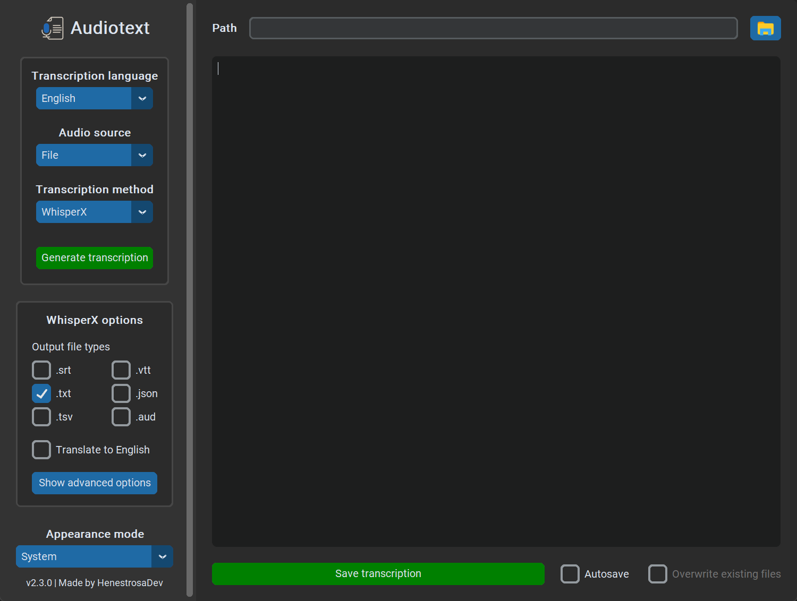

<div id="top"></div>

<!-- PROJECT SHIELDS -->
<!--
*** I am using markdown "reference style" links for readability.
*** Reference links are enclosed in brackets [ ] instead of parentheses ( ).
*** See the bottom of this document for the declaration of the reference variables
*** for contributors-url, forks-url, etc. This is an optional, concise syntax you may use.
*** https://www.markdownguide.org/basic-syntax/#reference-style-links
-->

<!-- PROJECT LOGO -->
<br />
<div align="center">
	<picture>
		<source 
			srcset="docs/light/icon.png" 
			width="128" 
			height="128" 
			media="(prefers-color-scheme: light)"
		/>
		<source 
			srcset="docs/dark/icon.png" 
			width="128" 
			height="128" 
			media="(prefers-color-scheme: dark)"
		/>
		
	</picture>
	<h1 align="center">Audiotext</h1>
	<p align="center">A desktop application that transcribes audio from a file or microphone in any supported language using <strong>WhisperX</strong> or <strong>Google Speech-to-Text API</strong>.</p>
	<p>
		<a href="https://github.com/HenestrosaDev/audiotext/stargazers">
			
		</a>
		<a href="https://github.com/HenestrosaDev/audiotext/graphs/contributors">
			
		</a>
		<a href="https://github.com/HenestrosaDev/audiotext/issues">
			
		</a>
		<a href="https://github.com/HenestrosaDev/audiotext/pulls">
			
		</a>
		<a href="https://github.com/HenestrosaDev/audiotext/blob/main/LICENSE">
			
		</a>
	</p>
	<p>
		<a href="https://github.com/HenestrosaDev/audiotext/issues/new/choose">Report Bug</a> · <a href="https://github.com/HenestrosaDev/audiotext/issues/new/choose">Request Feature</a> · <a href="https://github.com/HenestrosaDev/audiotext/discussions">Ask Question</a>
	</p>
</div>

<!-- TABLE OF CONTENTS -->

## Table of Contents

- [About the Project](#about-the-project)
    - [Project Structure](#project-structure)
    - [Built With](#built-with)
- [Getting Started](#getting-started)
    - [Notes](#notes) 
    - [To Run the Program](#to-run-the-program)
    - [To Set Up the Project Locally](#to-set-up-the-project-locally)
- [Usage](#usage)
    - [Transcribe Using](#transcribe-using)
    - [Transcribe From Microphone](#transcribe-from-microphone)
    - [Select File](#select-file)
    - [Generate Transcription](#generate-transcription)
    - [Save Transcription](#save-transcription)
    - [WhisperX Options](#whisperx-options)
        - [Transcription Translation](#transcription-translation)
        - [Generate Subtitles](#generate-subtitles)
    - [WhisperX Advanced Options](#whisperx-advanced-options)
        - [Model Size](#model-size)
        - [Compute Type](#compute-type)
        - [Batch Size](#batch-size)
        - [Use CPU](#use-cpu)
    - [Google Speech-To-Text API Options](#google-speech-to-text-api-options)
        - [API Key](#api-key) 
    - [Appearance Mode](#appearance-mode)
    - [Troubleshooting](#troubleshooting)
- [Roadmap](#roadmap)
- [Authors](#authors)
- [Contributing](#contributing)
- [Acknowledgments](#acknowledgments)
- [License](#license)
- [Support](#support)

<!-- ABOUT THE PROJECT -->

## About the Project


**Audiotext** transcribes the audio from an audio file, video file or microphone input into one of the 74 different languages it supports, along with some of their dialects. You can transcribe using [**WhisperX**](https://github.com/m-bain/whisperX) or the [**Google Speech-to-Text API**](https://cloud.google.com/speech-to-text).

If you use the **WhisperX** transcription method, you can translate the input audio into any other language you want (although, according to **OpenAI Whisper**, the only official language supported is English) and generate subtitles in `.srt` and `.vtt` format.

<details>
  <summary>List of supported languages</summary>

  - Afrikaans  
  - Amharic (አማርኛ)  
  - Arabic (لعربية)  
  - Armenian (հայերեն)  
  - Azerbaijan (Azərbaycan)  
  - Basque (Euskara)  
  - Belarusian (беларуская)  
  - Bengali (বাংলা)  
  - Bulgarian (Български)  
  - Catalan (Català)  
  - Chinese (China) (中文（中国）)  
  - Chinese (Hong Kong) (中文（香港)  
  - Chinese (Taiwan) (中文（台灣）)  
  - Croatian (Hrvatski)  
  - Czech (Čeština)  
  - Danish (Dansk)  
  - Dutch (Nederlands)  
  - English  
  - Estonian (Eesti keel)  
  - Farsi (فارسی)  
  - Filipino  
  - Finnish (Suomi)  
  - French (Français)  
  - Galician (Galego)  
  - Georgian (ქართული)  
  - German (Deutsch)  
  - German (Swiss Standard) (Schweizer Hochdeutsch)  
  - Greek (Ελληνικά)  
  - Gujarati (ગુજરાતી)  
  - Hebrew (עברית)  
  - Hindi (हिन्दी)  
  - Hungarian (Magyar)  
  - Icelandic (Íslenska)  
  - Indonesian (Bahasa Indonesia)  
  - Italian (Italiano)  
  - Swiss Italian (Italiano (Svizzera))  
  - Japanese (日本語)  
  - Javanese (Basa Jawa)  
  - Kannada (ಕನ್ನಡ)  
  - Kazakh (Қазақ)  
  - Khmer (ខ្មែរ)  
  - Korean (한국어)  
  - Lao (ລາວ)  
  - Latvian (Latviešu)  
  - Lithuanian (Lietuvių)  
  - Malay (Bahasa Melayu)  
  - Malayalam (മലയാളം)  
  - Maltese (Malti)  
  - Marathi (मराठी)  
  - Mongolian (Монгол)  
  - Nepali (नेपाली)  
  - Norwegian (Bokmål)  
  - Norwegian Nynorsk (Norsk (Nynorsk))  
  - Polish (Polski)  
  - Portuguese (Português)  
  - Punjabi (ਪੰਜਾਬੀ)  
  - Romanian (Română)  
  - Russian (Русский)  
  - Serbian (Српски)  
  - Sinhala (සිංහල)  
  - Slovak (Slovenčina)  
  - Slovenian (Slovenščina)  
  - Spanish (Español)  
  - Sundanese (Basa Sunda)  
  - Swahili (Kiswahili)  
  - Swedish (Svenska)  
  - Tamil (தமிழ்)  
  - Telugu (తెలుగు)  
  - Thai (ไทย)  
  - Turkish (Türkçe)  
  - Ukrainian (Українська)  
  - Urdu (اردو)  
  - Vietnamese (Tiếng Việt)  
  - Zulu (Isizulu)  
</details>

You can also choose the theme you like best. It can be dark, light, or the one configured in the system.

<!-- PROJECT STRUCTURE -->

### Project Structure

<details>
  <summary>ASCII folder structure</summary>

  ```
  │   .gitignore
  │   audiotext.spec
  │   LICENSE
  │   README.md
  │   requirements.txt
  │
  ├───.github
  │   │   CONTRIBUTING.md
  │   │
  │   ├───ISSUE_TEMPLATE
  │   │       bug_report_template.md
  │   │       feature_request_template.md
  │   │
  │   └───PULL_REQUEST_TEMPLATE
  │           pull_request_template.md
  │
  ├───res
  │   ├───img
  │   │       icon.ico
  │   │
  │   └───locales
  │       │   main_controller.pot
  │       │   main_window.pot
  │       │
  │       ├───en
  │       │   └───LC_MESSAGES
  │       │           app.mo
  │       │           app.po
  │       │           main_controller.po
  │       │           main_window.po
  │       │
  │       └───es
  │           └───LC_MESSAGES
  │                   app.mo
  │                   app.po
  │                   main_controller.po
  │                   main_window.po
  │
  └───src
      │   app.py
      │
      ├───controller
      │       __init__.py
      │       main_controller.py
      │
      ├───model
      │   │   __init__.py
      │   │   transcription.py
      │   │     
      │   └───config
      │           __init__.py
      │           config_google_api.py
      │           config_subtitles.py
      │           config_whisperx.py
      │
      ├───utils
      │       __init__.py
      │       audio_utils.py
      │       config_manager.py
      │       constants.py
      │       dict_utils.py
      │       enums.py
      │       i18n.py
      │       path_helper.py
      │
      └───view
          │   __init__.py   
          │   main_window.py
          │    
          └───custom_widgets
                  __init__.py
                  ctk_scrollable_dropdown/
                  ctk_input_dialog.py
  ```
</details>

<!-- BUILT WITH -->

### Built With

- [CustomTkinter](https://github.com/TomSchimansky/CustomTkinter) for the GUI.
- [CTkScrollableDropdown](https://github.com/Akascape/CTkScrollableDropdown) for the scrollable option menu to display the full list of supported languages.
- [moviepy](https://pypi.org/project/moviepy/) for video processing, from which the program extracts the audio to be transcribed.
- [PyAudio](https://pypi.org/project/PyAudio/) for recording microphone audio.
- [pydub](https://github.com/jiaaro/pydub) for audio processing.
- [SpeechRecognition](https://pypi.org/project/SpeechRecognition/) for converting audio into text.
- [WhisperX](https://github.com/m-bain/whisperX) for fast automatic speech recognition. Uses Whisper, an ASR model [developed by OpenAI](https://github.com/openai/whisper).
- [PyTorch](https://github.com/pytorch/pytorch) for building and training neural networks.
- [Torchaudio](https://pytorch.org/audio/stable/index.html) for audio processing tasks, including speech recognition and audio classification.
- [PyTorch-CUDA](https://pytorch.org/docs/stable/cuda.html) for enabling GPU support (CUDA) with PyTorch. CUDA is a parallel computing platform and application programming interface model created by NVIDIA.

<p align="right">(<a href="#top">back to top</a>)</p>

<!-- GETTING STARTED -->

## Getting Started

### Notes
- You cannot generate a single executable file for this project with PyInstaller due to the dependency with the CustomTkinter package (reason [here](https://github.com/TomSchimansky/CustomTkinter/wiki/Packaging)).
- For **Mac M1** users: An error occurs when trying to install the `pyaudio` package. [Here](https://stackoverflow.com/questions/73268630/error-could-not-build-wheels-for-pyaudio-which-is-required-to-install-pyprojec) is a StackOverflow post explaining how to solve this issue.
- You need to install [FFmpeg](https://ffmpeg.org) to execute the program. Otherwise, it won't be able to process the audio files. You can download it using the following commands:

  ```
  # on Ubuntu or Debian
  sudo apt update && sudo apt install ffmpeg
  
  # on Arch Linux
  sudo pacman -S ffmpeg
  
  # on MacOS using Homebrew (https://brew.sh/)
  brew install ffmpeg
  
  # on Windows using Chocolatey (https://chocolatey.org/)
  choco install ffmpeg
  
  # on Windows using Scoop (https://scoop.sh/)
  scoop install ffmpeg
  ```

### To Run the Program
1. Go to [releases](https://github.com/HenestrosaDev/audiotext/releases).
2. Download the latest release. 
3. Decompress the downloaded file.
4. Open the `audiotext` folder.
5. Double-click the `Audiotext` executable file (`.exe` for Windows and `.app` for macOS).

### To Set Up the Project Locally 
1. Change the current working directory to the location where you want the cloned directory.
2. Clone the repository by running `git clone https://github.com/HenestrosaDev/audiotext.git`.
3. Change the current working directory to `audiotext` by running `cd audiotext`.
4. (Optional but recommended) Create a Python virtual environment in the project root. If you are using `virtualenv`, you would run `virtualenv venv`.
5. (Optional but recommended) Activate the virtual environment:
   ```bash
   # on Windows
   . venv/Scripts/activate
   
   # on macOS and Linux
   source venv/Scripts/activate
   ```
6. Run `pip install -r requirements.txt` to install the dependencies.
7. Run `python src/app.py` to start the program.

>**IMPORTANT NOTE**: I had to comment out the lines `pprint(response_text, indent=4)` in the `recognize_google` function from the `__init__.py` file of the `SpeechRecognition` package to avoid opening a command line along with the GUI. Otherwise, the program would not be able to use the Google API transcription method because `pprint` throws an error if it cannot print to the CLI, preventing the code from generating the transcription. The same applies to the lines using the `logger` package in the `moviepy/audio/io/ffmpeg_audiowriter` file from the `moviepy` package. There is also a change in the line 169. `logger=logger` has been changed to `logger=None` to avoid more errors related to opening the console.

<p align="right">(<a href="#top">back to top</a>)</p>

<!-- USAGE -->

## Usage

Once you open the Audiotext executable file (explained in the [getting started](#getting-started) section), you will see something like this:

<picture>
	<source 
		srcset="docs/light/main.png"
		media="(prefers-color-scheme: light)"
	/>
	<source 
		srcset="docs/dark/main.png"
		media="(prefers-color-scheme: dark)"
	/>
	
</picture>

### Transcribe Using

Before you start transcribing, it is important to understand what each transcription method offers:

- **WhisperX**: Selected by default. This method runs locally on your machine. It performs better on a CUDA GPU, although it can also run on a CPU. The transcriptions generated by **WhisperX** are generally **much more** accurate than those generated by the **Google API**, although it also depends on the [model size](#model-size) and the [computation type](#compute-type) selected. It also offers more features, such as generating subtitles and translating the input audio to any other supported language. It's also much faster, especially when transcribing large files. It has no usage restrictions and it's completely free.
- **Google Speech-To-Text API** (abbreviated as "Google API"): **Audiotext** sends the audio to a remote API to get the transcription. It doesn't punctuate sentences, so you'll probably need to tweak the transcriptions it generates. It has a limited usage of 60 minutes per month in its free tier. However, you can add an [API key](#api-key) to extend its use.

### Transcribe From Microphone

Click on the `Transcribe from mic.` button and say whatever you want to be transcribed. Keep in mind that your operating system needs to recognize an input source. Otherwise, an error will be shown in the text box indicating that no microphone was detected.

Once you click it, the text changes to `Stop recording`. Until you click it again, everything you say will be recorded. Here is a video that demonstrates this feature:

<!-- english.mp4 -->
https://github.com/HenestrosaDev/audiotext/assets/60482743/bd0323d7-ff54-4363-8b73-a2d56e7f783b

### Select File

Click on the `Select file` button and select a file from the file explorer. Note that `All supported files` are selected by default. To select only audio files or video files, you will have to click on the combo box in the bottom right corner of the file explorer to change the file type, as marked in red in the following image:


<details>
	<summary>Supported audio file formats</summary>

  - `.mp3`
  - `.mpeg`
  - `.wav`
  - `.wma`
  - `.aac`
  - `.flac`
  - `.ogg`
  - `.oga`
  - `.opus`
</details>

<details>
	<summary>Supported video file formats</summary>

  - `.mp4`
  - `.m4a`
  - `.m4v`
  - `.f4v`
  - `.f4a`
  - `.m4b`
  - `.m4r`
  - `.f4b`
  - `.mov`
  - `.avi`
  - `.webm`
  - `.flv`
  - `.mkv`
  - `.3gp`
  - `.3gp2`
  - `.3g2`
  - `.3gpp`
  - `.3gpp2`
  - `.ogv`
  - `.ogx`
  - `.wmv`
  - `.asf`
</details>

### Generate Transcription

Once you have selected the file, the green `Generate transcription` button will become enabled. Click it to start the transcription process. If there are no errors, you will see the transcription of the audio in the text box, as shown in the image of the [About the Project](#about-the-project) section.

### Save Transcription

Once the program has generated the transcription, you will see a green `Save transcription` button below the text box. If you click on it, you'll be prompted for a file explorer where you can give the file a name and select the path where you want to save it. The file extension is `.txt` by default, but you can change it to any other text file type.

If you used **WhisperX** to generate the transcription and checked the `Generate subtitles` option, you'll notice that two files are also saved along with the text file: a `.vtt` file and a `.srt` file. Both contain the subtitles for the transcribed file, as explained in the [Generate Subtitles](#generate-subtitles) section.

### WhisperX Options

The **WhisperX** options appear when the selected transcription method is **WhisperX**. You can choose whether to translate the audio into English and whether to generate subtitles from the transcription. 

<p align="center">
    <picture>
        <source 
            srcset="docs/light/whisperx-options.png" 
            media="(prefers-color-scheme: light)"
        />
        <source 
            srcset="docs/dark/whisperx-options.png" 
            media="(prefers-color-scheme: dark)"
        />
        
    </picture>
</p>

#### Transcription Translation

To translate the audio into English, simply check the `Translate to English` checkbox before generating the transcription, as shown in the video below.

<!-- french-to-english.mp4 -->
https://github.com/HenestrosaDev/audiotext/assets/60482743/0aeeaa17-432f-445c-b29a-d76839be489b

However, there is another unofficial way to translate audio into any supported language by setting the `Audio language` to the target translation language. For example, if the audio is in English and you want to translate it into Spanish, you'd set the `Audio language` to "Spanish".

Here is a practical example using the microphone:

<!-- english-to-spanish.mp4 -->
https://github.com/HenestrosaDev/audiotext/assets/60482743/b346290f-4654-48c4-bf5a-2dcb75b136e9

Make sure to double-check the generated translations.

#### Generate Subtitles

As with the `Translate to English` option, to generate subtitles you simply need to check the option `Generate subtitles` before generating the transcription.

When you select this option, you'll see a "Subtitle options" frame like the one below with these two options:

- **Highlight words**: Underline each word as it is spoken in `.srt` and `.vtt` subtitle files. Not checked by default.
- **Max. line count**: The maximum number of lines in a segment. `2` by default.
- **Max. line width**: The maximum number of characters in a line before breaking the line. `42` by default.

<p align="center">
    <picture>
        <source 
            srcset="docs/light/subtitle-options.png" 
            media="(prefers-color-scheme: light)"
        />
        <source 
            srcset="docs/dark/subtitle-options.png" 
            media="(prefers-color-scheme: dark)"
        />
        
    </picture>
</p>

To get the files after the audio is transcribed, click `Save transcription` and select the path where you want to save the files, as explained in the [Save Transcription](#save-transcription) section.

The output formats are `.vtt` and `.srt`, which are two of the most common subtitle file formats. Unfortunately, there is no current support for the `.ass` file type at the moment, but it will be added as soon as **WhisperX** fixes a bug that prevented it from being created correctly.

### WhisperX Advanced Options

When you click the `Show advanced options` button from the "WhisperX options" frame, the "Advanced options" frame appears, as shown in the figure below.  

<p align="center">
    <picture>
        <source 
            srcset="docs/light/whisperx-advanced-options.png" 
            media="(prefers-color-scheme: light)"
        />
        <source 
            srcset="docs/dark/whisperx-advanced-options.png" 
            media="(prefers-color-scheme: dark)"
        />
        
    </picture>
</p>

It's highly recommended that you don't change the default configuration unless you're having problems with **WhisperX** or you know exactly what you're doing, especially with the "Compute type" and "Batch size" options. Change them at your own risk and be aware that you may experience problems or even need to reboot the system if the GPU runs out of VRAM.

#### Model Size

There are five main model sizes that offer tradeoffs between speed and accuracy. The larger the model size, the more VRAM it uses and the longer it takes to transcribe. Below are the names of the available models and their approximate memory requirements. The speed may vary depending on many factors including the available hardware, and since there is no concrete data from **WhisperX** about the performance of each model, I can't provide an updated table from the one detailed in [OpenAI's Whisper README](https://github.com/openai/whisper) (see below). According to [WhisperX](https://github.com/m-bain/whisperX), the `large-v2` model requires <8GB of GPU memory and batches inference for 70x real-time transcription.

>`large` is split into three versions: `large-v1`, `large-v2`, and `large-v3`. The default model size is `large-v2`, since `large-v3` presents some errors that weren't as common in `large-v2`, such as hallucination and repetition, especially for certain languages like Japanese. There are also more prevalent problems with missing punctuation and capitalization. See the announcements of the [`large-v2`](https://github.com/openai/whisper/discussions/661) and the [`large-v3`](https://github.com/openai/whisper/discussions/1762) models to have more insight into their differences.

|  Model   | Parameters | Required VRAM  |
|:--------:|:----------:|:--------------:|
|  `tiny`  |    39 M    |     ~1 GB      |
|  `base`  |    74 M    |     ~1 GB      |
| `small`  |   244 M    |     ~2 GB      |
| `medium` |   769 M    |     ~5 GB      |
| `large`  |   1550 M   |     <8 GB      |

The larger the model size, the lower the WER (Word Error Rate in %). The table below is taken from [this Medium article](https://blog.ml6.eu/fine-tuning-whisper-for-dutch-language-the-crucial-role-of-size-dd5a7012d45f), which analyzes the performance of pre-trained Whisper models on Dutch common voice.

|  Model   |  WER  |
|:--------:|:-----:|
|   tiny   | 50.98 |
|  small   | 17.90 |
| large-v2 | 7.81  |

#### Compute Type

This term refers to different data types used in computing, particularly in the context of numerical representation. It determines how numbers are stored and represented in a computer's memory.

The higher the precision, the more resources will be needed and the better the transcription will be.

There are three possible values:
- `int8`: Default if using CPU. It represents whole numbers without any fractional part. Its size is 8 bits (1 byte) and it can represent integer values from -128 to 127 (signed) or 0 to 255 (unsigned). in scenarios where memory efficiency is critical, such as in quantized neural networks or edge devices with limited computational resources.
- `float16`: Default if using CUDA GPU. It's a half precision type representing 16-bit floating point numbers. Its size is 16 bits (2 bytes). It has a smaller range and precision compared to `float32`. It is often used in applications where memory is a critical resource, such as in deep learning models running on GPUs or TPUs.
- `float32`: Recommended for CUDA GPUs with more than 8 GB of VRAM. It's a single precision type representing 32-bit floating point numbers, which is a standard for representing real numbers in computers. Its size is 32 bits (4 bytes). It can represent a wide range of real numbers with a reasonable level of precision. 
 
#### Batch Size

This option determines how many samples are processed together before the model parameters are updated. It doesn't affect the quality of the transcription, only the generation speed (the smaller, the slower).

For simplicity, let's divide the possible batch size values into two groups:

- Small batch size (<=8): Training with small batch sizes means that model weights are updated more frequently, potentially leading to more stable convergence. They use less memory, which can be important when working with limited resources. `8` is the default value.
- Large batch size (>8): Speeds up in training, especially on hardware optimized for parallel processing such as GPUs. Max. recommended to `16`.

#### Use CPU

Checked by default if there is no CUDA GPU. **WhisperX** will use the CPU for transcription if checked.

As noted in the [Compute Type](#compute-type) section, the default compute type value for the CPU is `int8`, since many CPUs don't support efficient `float16` or `float32` computation, which would result in an error. Change it at your own risk. 

### Google Speech-To-Text API Options

The "**Google API** options" frame appears when the selected transcription method is **Google API**.

<p align="center">
    <picture>
        <source 
            srcset="docs/light/google-api-options.png" 
            media="(prefers-color-scheme: light)"
        />
        <source 
            srcset="docs/dark/google-api-options.png" 
            media="(prefers-color-scheme: dark)"
        />
        
    </picture>
</p>

#### API Key

Since the program uses **Google's Speech-To-Text API** free tier by default, which allows you to transcribe up to 60 minutes of audio per month for free, you may need to add an API key if you want to make extensive use of this feature. To do this, click on the `Set API key` button. Once you click on it, you'll be presented with a dialog box where you can enter your API key, which will **only** be used to make requests to the API.

<p align="center">
    <picture>
        <source 
            srcset="docs/light/google-api-key-dialog.png" 
            media="(prefers-color-scheme: light)"
        />
        <source 
            srcset="docs/dark/google-api-key-dialog.png" 
            media="(prefers-color-scheme: dark)"
        />
        
    </picture>
<p align="center">

Remember that **WhisperX** offers fast, unlimited audio transcription that supports translation and subtitle generation for free. Also note that Google charges for the use of the API key, for which Audiotext is not responsible. 

### Appearance Mode

The program supports three appearance modes:

<details>
  <summary>System (default)</summary>
  
</details>

<details>
  <summary>Dark</summary>
  
</details>

<details>
  <summary>Light</summary>
  
</details>

### Troubleshooting

- Generating a transcription may take some time depending on the length and size of the audio and whether it is extracted from an audio or video file. Do not close the program, even if it appears to be unresponsive.
- The first transcription created by **WhisperX** will take a while. That's because **Audiotext** needs to load the model, which can take a while, even a few minutes, depending on the hardware the program is running on. Once it's loaded, however, you'll notice a dramatic increase in the speed of subsequent transcriptions using this method.
- If you get the error `RuntimeError: CUDA Out of memory` or want to reduce GPU memory requirements, try any of the following (2 and 3 can affect quality) (taken from [WhisperX README](https://github.com/m-bain/whisperX#technical-details-%EF%B8%8F)):
  1. Reduce batch size, e.g. `4`
  2. Use a smaller ASR model, e.g. `base`
  3. Use lighter compute type, e.g. `int8`

<p align="right">(<a href="#top">back to top</a>)</p>

<!-- ROADMAP -->

## Roadmap

- [x] Add support for [**WhisperX**](https://github.com/m-bain/whisperX).
- [x] Generate `.srt` and `.vtt` files for subtitles (only for **WhisperX**).
- [x] Add "Stop recording" button state when recording from the microphone.
- [x] Add a dialogue to let users input their **Google Speech-To-Text API** key.
- [x] Add subtitle options.
- [x] Add advanced options for **WhisperX**.
- [ ] Generate executables for macOS and Linux.
- [ ] Add pre-commit config for using `Black`, `isort`, and `mypy`.
- [ ] Add tests.

You can propose a new feature creating an [issue](https://github.com/HenestrosaDev/audiotext/issues/new/choose).

<!-- AUTHORS -->

## Authors

- HenestrosaDev <henestrosadev@gmail.com> (José Carlos López Henestrosa)

See also the list of [contributors](https://github.com/HenestrosaDev/audiotext/contributors) who participated in this project.

<!-- CONTRIBUTING -->

## Contributing  

Contributions are what make the open source community such an amazing place to learn, inspire, and create. Any contributions you make are **greatly appreciated**.
Please read the [CONTRIBUTING.md](https://github.com/HenestrosaDev/audiotext/blob/main/.github/CONTRIBUTING.md) file, where you can find more detailed information about how to contribute to the project.

<!-- ACKNOWLEDGMENTS -->

## Acknowledgments

I have made use of the following resources to make this project:

- [Extracting speech from video using Python](https://towardsdatascience.com/extracting-speech-from-video-using-python-f0ec7e312d38)
- [How to translate Python applications with the GNU gettext module](https://phrase.com/blog/posts/translate-python-gnu-gettext/)
- [Speech recognition on large audio files](https://www.geeksforgeeks.org/python-speech-recognition-on-large-audio-files/)

<!-- LICENSE -->

## License

Distributed under the MIT License. See [`LICENSE`](https://github.com/HenestrosaDev/audiotext/blob/main/LICENSE) for more information.

<!-- SUPPORT -->

## Support

Would you like to support the project? That's very kind of you! However, I would suggest you to consider supporting the packages that I've used to build this project first. If you still want to support this particular project, you can go to my Ko-Fi profile by clicking on the button down below!

[](https://ko-fi.com/henestrosadev)

<p align="right">(<a href="#top">back to top</a>)</p>
