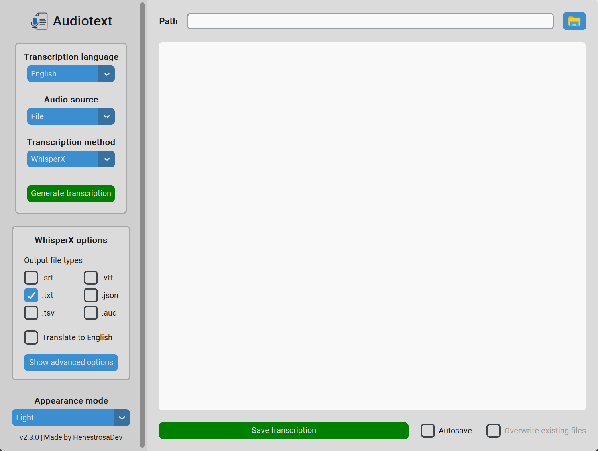

<div id="top"></div>

<!-- PROJECT SHIELDS -->
<!--
*** I am using markdown "reference style" links for readability.
*** Reference links are enclosed in brackets [ ] instead of parentheses ( ).
*** See the bottom of this document for the declaration of the reference variables
*** for contributors-url, forks-url, etc. This is an optional, concise syntax you may use.
*** https://www.markdownguide.org/basic-syntax/#reference-style-links
-->

<!-- PROJECT LOGO -->
<br />
<div align="center">
	<picture>
		<source 
			srcset="docs/light/icon.png" 
			alt="Logo"
			width="128" 
			height="128" 
			media="(prefers-color-scheme: light)"
		/>
		<source 
			srcset="docs/dark/icon.png" 
			alt="Logo"
			width="128" 
			height="128" 
			media="(prefers-color-scheme: dark)"
		/>
		
	</picture>
	<h1 align="center">Audiotext</h1>
	<p align="center">A desktop application that transcribes audio from a file or microphone in any supported language using <strong>WhisperX</strong> or <strong>Google Speech-to-Text API</strong>.</p>
	<p>
		<a href="https://github.com/HenestrosaDev/audiotext/stargazers">
			
		</a>
		<a href="https://github.com/HenestrosaDev/audiotext/graphs/contributors">
			
		</a>
		<a href="https://github.com/HenestrosaDev/audiotext/issues">
			
		</a>
		<a href="https://github.com/HenestrosaDev/audiotext/pulls">
			
		</a>
		<a href="https://github.com/HenestrosaDev/audiotext/blob/main/LICENSE">
			
		</a>
	</p>
	<p>
		<a href="https://github.com/HenestrosaDev/audiotext/issues/new/choose">Report Bug</a> · <a href="https://github.com/HenestrosaDev/audiotext/issues/new/choose">Request Feature</a> · <a href="https://github.com/HenestrosaDev/audiotext/discussions">Ask Question</a>
	</p>
</div>

<!-- TABLE OF CONTENTS -->

## Table of Contents

- [About the Project](#about-the-project)
    - [Project Structure](#project-structure)
    - [Built With](#built-with)
- [Getting Started](#getting-started)
    - [Notes](#notes) 
    - [To Execute the Program](#to-execute-the-program)
    - [To Get the Code](#to-get-the-code)
- [Usage](#usage)
    - [Transcribe From Microphone](#transcribe-from-microphone)
    - [Select File](#select-file)
    - [Save Transcription](#save-transcription)
    - [Appearance Mode](#appearance-mode)
    - [Transcription Translation](#transcription-translation)
    - [Google's Speech-To-Text API Usage](#googles-speech-to-text-api-usage)
- [Roadmap](#roadmap)
- [Authors](#authors)
- [Contributing](#contributing)
- [Acknowledgments](#acknowledgments)
- [License](#license)
- [Support](#support)

<!-- ABOUT THE PROJECT -->

## About the Project

<picture>
	<source 
		srcset="docs/light/main.png" 
		alt="Main"
		media="(prefers-color-scheme: light)"
	/>
	<source 
		srcset="docs/dark/main.png" 
		alt="Main"
		media="(prefers-color-scheme: dark)"
	/>
	
</picture>

**Audiotext** transcribes the audio from an audio file, video file or microphone input into one of the 74 different languages it supports, along with some of their dialects. You can transcribe using [**WhisperX**](https://github.com/m-bain/whisperX) or the [**Google Speech-to-Text API**](https://cloud.google.com/speech-to-text).

If you use the **WhisperX** transcription method, you can translate the input audio into any other language you want (although, according to **OpenAI Whisper**, the only official language supported is English) and generate subtitles in `.srt` and `.vtt` format.

You can also choose the theme you like best. It can be dark, light, or the one configured in the system.

<details>
  <summary>List of supported languages</summary>

  - Afrikaans  
  - Amharic (አማርኛ)  
  - Arabic (لعربية)  
  - Armenian (հայերեն)  
  - Azerbaijan (Azərbaycan)  
  - Basque (Euskara)  
  - Belarusian (беларуская)  
  - Bengali (বাংলা)  
  - Bulgarian (Български)  
  - Catalan (Català)  
  - Chinese (China) (中文（中国）)  
  - Chinese (Hong Kong) (中文（香港)  
  - Chinese (Taiwan) (中文（台灣）)  
  - Croatian (Hrvatski)  
  - Czech (Čeština)  
  - Danish (Dansk)  
  - Dutch (Nederlands)  
  - English  
  - Estonian (Eesti keel)  
  - Farsi (فارسی)  
  - Filipino  
  - Finnish (Suomi)  
  - French (Français)  
  - Galician (Galego)  
  - Georgian (ქართული)  
  - German (Deutsch)  
  - German (Swiss Standard) (Schweizer Hochdeutsch)  
  - Greek (Ελληνικά)  
  - Gujarati (ગુજરાતી)  
  - Hebrew (עברית)  
  - Hindi (हिन्दी)  
  - Hungarian (Magyar)  
  - Icelandic (Íslenska)  
  - Indonesian (Bahasa Indonesia)  
  - Italian (Italiano)  
  - Swiss Italian (Italiano (Svizzera))  
  - Japanese (日本語)  
  - Javanese (Basa Jawa)  
  - Kannada (ಕನ್ನಡ)  
  - Kazakh (Қазақ)  
  - Khmer (ខ្មែរ)  
  - Korean (한국어)  
  - Lao (ລາວ)  
  - Latvian (Latviešu)  
  - Lithuanian (Lietuvių)  
  - Malay (Bahasa Melayu)  
  - Malayalam (മലയാളം)  
  - Maltese (Malti)  
  - Marathi (मराठी)  
  - Mongolian (Монгол)  
  - Nepali (नेपाली)  
  - Norwegian (Bokmål)  
  - Norwegian Nynorsk (Norsk (Nynorsk))  
  - Polish (Polski)  
  - Portuguese (Português)  
  - Punjabi (ਪੰਜਾਬੀ)  
  - Romanian (Română)  
  - Russian (Русский)  
  - Serbian (Српски)  
  - Sinhala (සිංහල)  
  - Slovak (Slovenčina)  
  - Slovenian (Slovenščina)  
  - Spanish (Español)  
  - Sundanese (Basa Sunda)  
  - Swahili (Kiswahili)  
  - Swedish (Svenska)  
  - Tamil (தமிழ்)  
  - Telugu (తెలుగు)  
  - Thai (ไทย)  
  - Turkish (Türkçe)  
  - Ukrainian (Українська)  
  - Urdu (اردو)  
  - Vietnamese (Tiếng Việt)  
  - Zulu (Isizulu)  
</details>

<!-- PROJECT STRUCTURE -->

### Project Structure

<details>
  <summary>ASCII folder structure</summary>

  ```
  │   .gitignore
  │   audiotext.spec
  │   LICENSE
  │   README.md
  │   requirements.txt
  │
  ├───.github
  │   │   CONTRIBUTING.md
  │   │
  │   ├───ISSUE_TEMPLATE
  │   │       bug_report_template.md
  │   │       feature_request_template.md
  │   │
  │   └───PULL_REQUEST_TEMPLATE
  │           pull_request_template.md
  │
  ├───res
  │   ├───img
  │   │       icon.ico
  │   │
  │   └───locales
  │       │   main_controller.pot
  │       │   main_window.pot
  │       │
  │       ├───en
  │       │   └───LC_MESSAGES
  │       │           app.mo
  │       │           app.po
  │       │           main_controller.po
  │       │           main_window.po
  │       │
  │       └───es
  │           └───LC_MESSAGES
  │                   app.mo
  │                   app.po
  │                   main_controller.po
  │                   main_window.po
  │
  └───src
      │   app.py
      │
      ├───controller
      │       __init__.py
      │       main_controller.py
      │
      ├───model
      │       __init__.py
      │       transcription.py
      │       transcription_method.py
      │
      ├───utils
      │       __init__.py
      │       audio_utils.py
      │       constants.py
      │       dict_utils.py
      │       google_api_key_helper.py
      │       i18n.py
      │       path_helper.py
      │
      └───view
              __init__.py   
              main_window.py
  ```
</details>

<!-- BUILT WITH -->

### Built With

- [CustomTkinter](https://github.com/TomSchimansky/CustomTkinter) for the GUI.
- [moviepy](https://pypi.org/project/moviepy/) for video processing, from which the program extracts the audio to be transcribed.
- [PyAudio](https://pypi.org/project/PyAudio/) for recording microphone audio.
- [pydub](https://github.com/jiaaro/pydub) for audio processing.
- [SpeechRecognition](https://pypi.org/project/SpeechRecognition/) for converting audio into text.
- [WhisperX](https://github.com/m-bain/whisperX) for fast automatic speech recognition. Uses Whisper, an ASR model [developed by OpenAI](https://github.com/openai/whisper).
- [PyTorch](https://github.com/pytorch/pytorch) for building and training neural networks.
- [Torchaudio](https://pytorch.org/audio/stable/index.html) for audio processing tasks, including speech recognition and audio classification.
- [PyTorch-CUDA](https://pytorch.org/docs/stable/cuda.html) for enabling GPU support (CUDA) with PyTorch. CUDA is a parallel computing platform and application programming interface model created by NVIDIA.

<p align="right">(<a href="#top">back to top</a>)</p>

<!-- GETTING STARTED -->

## Getting Started

### Notes
- Please bear in mind that you cannot generate a single executable file for this project with PyInstaller due to the dependency with the CustomTkinter package (reason [here](https://github.com/TomSchimansky/CustomTkinter/wiki/Packaging)).
- For **Mac M1** users: An error occurs when trying to install the `pyaudio` package. [Here](https://stackoverflow.com/questions/73268630/error-could-not-build-wheels-for-pyaudio-which-is-required-to-install-pyprojec) is a StackOverflow post explaining how to solve this issue.
- You need to install [FFmpeg](https://ffmpeg.org) to execute the program. Otherwise, it won't be able to process the audio files. You can download it using the following commands:

  ```
  # on Ubuntu or Debian
  sudo apt update && sudo apt install ffmpeg
  
  # on Arch Linux
  sudo pacman -S ffmpeg
  
  # on MacOS using Homebrew (https://brew.sh/)
  brew install ffmpeg
  
  # on Windows using Chocolatey (https://chocolatey.org/)
  choco install ffmpeg
  
  # on Windows using Scoop (https://scoop.sh/)
  scoop install ffmpeg
  ```

### To Execute the Program
1. Go to [releases](https://github.com/HenestrosaDev/audiotext/releases).
2. Download the latest release. 
3. Decompress the downloaded file.
4. Open the `audiotext` folder.
5. Double-click the `audiotext.exe` file if you are using **Windows** or the `audiotext` file if you are using **GNU-Linux** or **macOS**.

### To Get the Code
1. Clone the project running `git clone https://github.com/HenestrosaDev/audiotext.git`.

<p align="right">(<a href="#top">back to top</a>)</p>

<!-- USAGE -->

## Usage

Once you open the Audiotext executable file (explained in the [getting started](#getting-started) section), you will see something like the image above.

### Transcribe From Microphone

Click on the `Transcribe from mic.` button and say whatever you want to be transcribed. Keep in mind that your operating system needs to recognize an input source. Otherwise, an error will be shown in the text box indicating that no microphone was detected.

Once you click the button, the text changes to `Stop recording`. Until you click it again, everything you say will be recorded. Here is a video demonstrating this feature:

https://github.com/HenestrosaDev/audiotext/assets/60482743/79bcb4f3-63c2-4626-bcbc-033ba21a0859

### Select File

Click on the `Select file` button and select a file from the file explorer. Note that `All supported files` are selected by default. To select only audio files or video files, you will have to click on the combo box in the bottom right corner of the file explorer to change the file type, as marked in red in the following image:


<details>
	<summary>Supported audio file formats</summary>

  - `.mp3`
  - `.mpeg`
  - `.wav`
  - `.wma`
  - `.aac`
  - `.flac`
  - `.ogg`
  - `.oga`
  - `.opus`
</details>

<details>
	<summary>Supported video file formats</summary>

  - `.mp4`
  - `.m4a`
  - `.m4v`
  - `.f4v`
  - `.f4a`
  - `.m4b`
  - `.m4r`
  - `.f4b`
  - `.mov`
  - `.avi`
  - `.webm`
  - `.flv`
  - `.mkv`
  - `.3gp`
  - `.3gp2`
  - `.3g2`
  - `.3gpp`
  - `.3gpp2`
  - `.ogv`
  - `.ogx`
  - `.wmv`
  - `.asf`
</details>

Once you have selected the file, the green `Generate transcription` button will become enabled. Click it to start the transcription process. If there is no error, you will see the audio's transcription in the text box, like this:

<picture>
	<source 
		srcset="docs/light/generated.png" 
		alt="Main"
		media="(prefers-color-scheme: light)"
	/>
	<source 
		srcset="docs/dark/generated.png" 
		alt="Main"
		media="(prefers-color-scheme: dark)"
	/>
	
</picture>

Note that this process may take some time depending on the length of the file and whether it is an audio or video file. You will also notice that the first transcription with **WhisperX** will take a while. That's because **Audiotext** needs to load the model, which can take a while, even a few minutes, depending on the hardware the program is running on. However, once it's loaded, however, you'll notice a dramatic increase in the speed of subsequent transcriptions using this method.

### Save Transcription

Once the program has generated the transcription, you will see a green `Save transcription` button below the text box. If you click on it, you'll be prompted for a file explorer where you can give the file a name and select the path where you want to save it. By default, the file extension is `.txt`, but you can change it to any other file type.

If you used **WhisperX** to generate the transcription and checked the `Generate subtitles` option, you'll notice that two files are also saved along with the `.txt` file: a `.vtt` file and a `.srt` file. Both contain the subtitles for the transcribed file.

### Appearance Mode

The program supports three appearance modes:

<details>
  <summary>System (default)</summary>
  
</details>

<details>
  <summary>Dark</summary>
  
</details>

<details>
  <summary>Light</summary>
  
</details>

### Transcription Translation

To translate the audio into English, simply check the `Translate to English` checkbox with **WhisperX** transcription as the transcription method, as shown in the video below.

https://github.com/HenestrosaDev/audiotext/assets/60482743/61c67c38-a862-4b68-8502-4c30723950f4

However, there is another unofficial way to translate audio into any supported language by setting the `Audio language` to the target translation language. For example, if the audio is in English and you want to translate it into German, you'd set the `Audio language` to "German".

Here is a practical example using the microphone:

https://github.com/HenestrosaDev/audiotext/assets/60482743/b70e351f-c275-4ffb-894d-187411bbf160

### Google's Speech-To-Text API Usage

Since the program uses **Google's Speech-To-Text API** free tier, which allows you to transcribe up to 60 minutes of audio per month for free, you may need to add an API key if you want to make extensive use of this feature. To do this, click on the "Set API key" button with the Google API transcription method selected.

<picture>
	<source 
		srcset="docs/light/google-api-options.png" 
		alt="google-api-options"
		media="(prefers-color-scheme: light)"
	/>
	<source 
		srcset="docs/dark/google-api-options.png" 
		alt="google-api-options"
		media="(prefers-color-scheme: dark)"
	/>
	
</picture>

Once you click on the button, you'll be presented with a dialog box where you can enter your **Google Speech-To-Text API** key. The key will only be used to make requests to the API.

<picture>
	<source 
		srcset="docs/light/google-api-key-dialog.png" 
		alt="google-api-key-dialog"
		media="(prefers-color-scheme: light)"
	/>
	<source 
		srcset="docs/dark/google-api-key-dialog.png" 
		alt="google-api-key-dialog"
		media="(prefers-color-scheme: dark)"
	/>
	
</picture>

Remember that **WhisperX** offers fast, unlimited audio transcription that supports translation and subtitle generation. 

<p align="right">(<a href="#top">back to top</a>)</p>

<!-- ROADMAP -->

## Roadmap

- [x] Add support for [**WhisperX**](https://github.com/m-bain/whisperX).
- [x] Generate `.srt` and `.vtt` files for subtitles (only for **WhisperX**).
- [x] Add "Stop recording" button state when recording from the microphone.
- [x] Add a dialogue to let users input their **Google Speech-To-Text API** key.
- [ ] Generate executables for macOS and Linux.
- [ ] Add pre-commit config for using `Black`, `isort`, and `mypy`.
- [ ] Add tests.

You can propose a new feature creating an [issue](https://github.com/HenestrosaDev/audiotext/issues/new/choose).

<!-- AUTHORS -->

## Authors

- HenestrosaDev <henestrosadev@gmail.com> (José Carlos López Henestrosa)

See also the list of [contributors](https://github.com/HenestrosaDev/audiotext/contributors) who participated in this project.

<!-- CONTRIBUTING -->

## Contributing  

Contributions are what make the open source community such an amazing place to learn, inspire, and create. Any contributions you make are **greatly appreciated**.
Please read the [CONTRIBUTING.md](https://github.com/HenestrosaDev/audiotext/blob/main/.github/CONTRIBUTING.md) file, where you can find more detailed information about how to contribute to the project.

<!-- ACKNOWLEDGMENTS -->

## Acknowledgments

I have made use of the following resources to make this project:

- [Extracting speech from video using Python](https://towardsdatascience.com/extracting-speech-from-video-using-python-f0ec7e312d38)
- [How to translate Python applications with the GNU gettext module](https://phrase.com/blog/posts/translate-python-gnu-gettext/)
- [Speech recognition on large audio files](https://www.geeksforgeeks.org/python-speech-recognition-on-large-audio-files/)

<!-- LICENSE -->

## License

Distributed under the MIT License. See [`LICENSE`](https://github.com/HenestrosaDev/audiotext/blob/main/LICENSE) for more information.

<!-- SUPPORT -->

## Support

Would you like to support the project? That's very kind of you! However, I would suggest you to consider supporting the packages that I've used to build this project first. If you still want to support this particular project, you can go to my Ko-Fi profile by clicking on the button down below!

[](https://ko-fi.com/henestrosadev)

<p align="right">(<a href="#top">back to top</a>)</p>
