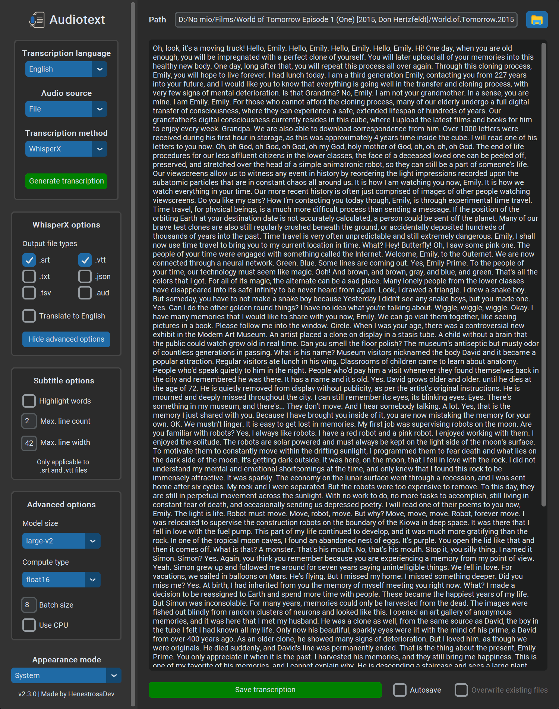
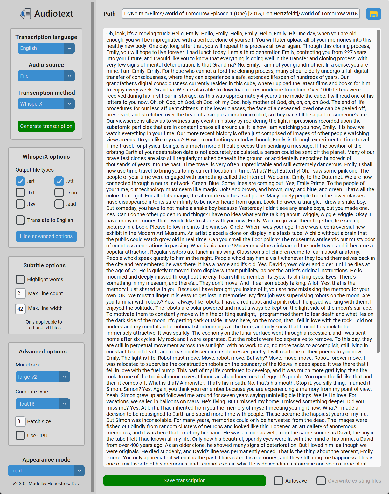
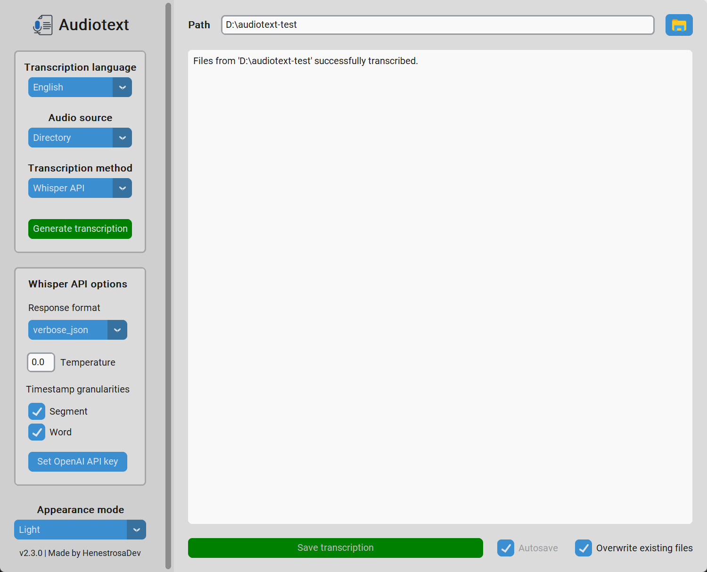
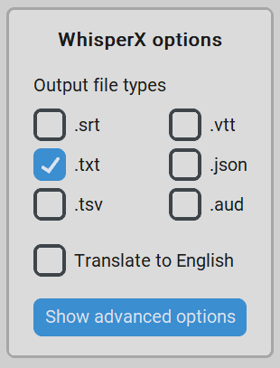
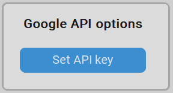

<div id="top"></div>

<!-- PROJECT SHIELDS -->
<!--
*** I am using markdown "reference style" links for readability.
*** Reference links are enclosed in brackets [ ] instead of parentheses ( ).
*** See the bottom of this document for the declaration of the reference variables
*** for contributors-url, forks-url, etc. This is an optional, concise syntax you may use.
*** https://www.markdownguide.org/basic-syntax/#reference-style-links
-->

<!-- PROJECT LOGO -->
<div align="center">
  <picture>
    <source 
      srcset="docs/light/icon.png" 
      width="128" 
      height="128" 
      media="(prefers-color-scheme: light)"
    />
    <source 
      srcset="docs/dark/icon.png" 
      width="128" 
      height="128" 
      media="(prefers-color-scheme: dark)"
    />
    
  </picture>
  <h1 align="center">Audiotext</h1>
  <p align="center">A desktop application that transcribes audio from files, microphone input or YouTube videos with the option to translate the content and create subtitles.</p>
  <p>
    <a href="https://github.com/HenestrosaDev/audiotext/releases/latest">
      
    </a>
    <a href="https://github.com/HenestrosaDev/audiotext/stargazers">
      
    </a>
    <a href="https://github.com/HenestrosaDev/audiotext/blob/main/LICENSE">
      
    </a>
    <br>
    <a href="https://github.com/HenestrosaDev/audiotext/graphs/contributors">
      
    </a>
    <a href="https://github.com/HenestrosaDev/audiotext/issues">
      
    </a>
    <a href="https://github.com/HenestrosaDev/audiotext/pulls">
      
    </a>
  </p>
  <p>
    <a href="https://github.com/HenestrosaDev/audiotext/issues/new/choose">
      Report Bug
    </a> 
    · 
    <a href="https://github.com/HenestrosaDev/audiotext/issues/new/choose">
      Request Feature
    </a> 
    · 
    <a href="https://github.com/HenestrosaDev/audiotext/discussions">
      Ask Question
    </a>
  </p>
</div>

<!-- TABLE OF CONTENTS -->

## Table of Contents

- [About the Project](#about-the-project)
    - [Supported Languages](#supported-languages)
    - [Supported File Types](#supported-file-types)
    - [Project Structure](#project-structure)
    - [Built With](#built-with)
- [Getting Started](#getting-started)
    - [Installation](#installation)
    - [Set Up the Project Locally](#set-up-the-project-locally)
    - [Notes](#notes) 
- [Usage](#usage)
    - [Transcribe Using](#transcribe-using)
    - [Transcribe From](#transcribe-from)
    - [Save Transcription](#save-transcription)
        - [Autosave](#autosave)
        - [Overwrite Existing Files](#overwrite-existing-files)
    - [WhisperX Options](#whisperx-options)
        - [Output File Types](#output-file-types)
        - [Transcription Translation](#transcription-translation)
    - [Subtitle Options](#subtitle-options)
    - [WhisperX Advanced Options](#whisperx-advanced-options)
        - [Model Size](#model-size)
        - [Compute Type](#compute-type)
        - [Batch Size](#batch-size)
        - [Use CPU](#use-cpu)
    - [Google Speech-To-Text API Options](#google-speech-to-text-api-options)
        - [API Key](#api-key)
    - [Troubleshooting](#troubleshooting)
- [Roadmap](#roadmap)
- [Authors](#authors)
- [Contributing](#contributing)
- [Acknowledgments](#acknowledgments)
- [License](#license)
- [Support](#support)

<!-- ABOUT THE PROJECT -->

## About the Project



**Audiotext** transcribes the audio from an audio file, video file, microphone input, directory, or YouTube video into one of the 99 different languages it supports. You can transcribe using the [**Google Speech-to-Text API**](https://cloud.google.com/speech-to-text) or [**WhisperX**](https://github.com/m-bain/whisperX), which can even translate the transcription or generate subtitles!

You can also choose the theme you like best. It can be dark, light, or the one configured in the system.

<details>
  <summary>Dark</summary>
  
</details>

<details>
  <summary>Light</summary>
  
</details>

<!-- SUPPORTED LANGUAGES -->

### Supported Languages

<details>
  <summary>Click here to display</summary>

  - Afrikaans
  - Albanian
  - Amharic
  - Arabic
  - Armenian
  - Assamese
  - Azerbaijan
  - Bashkir
  - Basque
  - Belarusian
  - Bengali
  - Bosnian
  - Breton
  - Bulgarian
  - Burmese
  - Catalan
  - Chinese
  - Chinese (Yue)
  - Croatian
  - Czech
  - Danish
  - Dutch
  - English
  - Estonian
  - Faroese
  - Farsi
  - Finnish
  - French
  - Galician
  - Georgian
  - German
  - Greek
  - Gujarati
  - Haitian
  - Hausa
  - Hawaiian
  - Hebrew
  - Hindi
  - Hungarian
  - Icelandic
  - Indonesian
  - Italian
  - Japanese
  - Javanese
  - Kannada
  - Kazakh
  - Khmer
  - Korean
  - Lao
  - Latin
  - Latvian
  - Lingala
  - Lithuanian
  - Luxembourgish
  - Macedonian
  - Malagasy
  - Malay
  - Malayalam
  - Maltese
  - Maori
  - Marathi
  - Mongolian
  - Nepali
  - Norwegian
  - Norwegian Nynorsk
  - Occitan
  - Pashto
  - Polish
  - Português
  - Punjabi
  - Romanian
  - Russian
  - Sanskrit
  - Serbian
  - Shona
  - Sindhi
  - Sinhala
  - Slovak
  - Slovenian
  - Somali
  - Spanish
  - Sundanese
  - Swahili
  - Swedish
  - Tagalog
  - Tajik
  - Tamil
  - Tatar
  - Telugu
  - Thai
  - Tibetan
  - Turkish
  - Turkmen
  - Ukrainian
  - Urdu
  - Uzbek
  - Vietnamese
  - Welsh
  - Yiddish
  - Yoruba
</details>

### Supported File Types

<details>
  <summary>Audio file formats</summary>

  - `.mp3`
  - `.mpeg`
  - `.wav`
  - `.wma`
  - `.aac`
  - `.flac`
  - `.ogg`
  - `.oga`
  - `.opus`
</details>

<details>
  <summary>Video file formats</summary>

  - `.mp4`
  - `.m4a`
  - `.m4v`
  - `.f4v`
  - `.f4a`
  - `.m4b`
  - `.m4r`
  - `.f4b`
  - `.mov`
  - `.avi`
  - `.webm`
  - `.flv`
  - `.mkv`
  - `.3gp`
  - `.3gp2`
  - `.3g2`
  - `.3gpp`
  - `.3gpp2`
  - `.ogv`
  - `.ogx`
  - `.wmv`
  - `.asf`
</details>

<!-- PROJECT STRUCTURE -->

### Project Structure

<details>
  <summary>ASCII folder structure</summary>

  ```
  │   .gitignore
  │   audiotext.spec
  │   LICENSE
  │   README.md
  │   requirements.txt
  │
  ├───.github
  │   │   CONTRIBUTING.md
  │   │
  │   ├───ISSUE_TEMPLATE
  │   │       bug_report_template.md
  │   │       feature_request_template.md
  │   │
  │   └───PULL_REQUEST_TEMPLATE
  │           pull_request_template.md
  │
  ├───res
  │   ├───img
  │   │       icon.ico
  │   │
  │   └───locales
  │       │   main_controller.pot
  │       │   main_window.pot
  │       │
  │       ├───en
  │       │   └───LC_MESSAGES
  │       │           app.mo
  │       │           app.po
  │       │           main_controller.po
  │       │           main_window.po
  │       │
  │       └───es
  │           └───LC_MESSAGES
  │                   app.mo
  │                   app.po
  │                   main_controller.po
  │                   main_window.po
  │
  └───src
      │   app.py
      │
      ├───controller
      │       __init__.py
      │       main_controller.py
      │
      ├───model
      │   │   __init__.py
      │   │   transcription.py
      │   │     
      │   └───config
      │           __init__.py
      │           config_google_api.py
      │           config_subtitles.py
      │           config_whisperx.py
      │
      ├───utils
      │       __init__.py
      │       audio_utils.py
      │       config_manager.py
      │       constants.py
      │       dict_utils.py
      │       enums.py
      │       i18n.py
      │       path_helper.py
      │
      └───view
          │   __init__.py   
          │   main_window.py
          │    
          └───custom_widgets
                  __init__.py
                  ctk_scrollable_dropdown/
                  ctk_input_dialog.py
  ```
</details>

<!-- BUILT WITH -->

### Built With

- [CTkScrollableDropdown](https://github.com/Akascape/CTkScrollableDropdown) for the scrollable option menu to display the full list of supported languages.
- [CustomTkinter](https://github.com/TomSchimansky/CustomTkinter) for the GUI.
- [moviepy](https://pypi.org/project/moviepy/) for video processing, from which the program extracts the audio to be transcribed.
- [PyAudio](https://pypi.org/project/PyAudio/) for recording microphone audio.
- [pydub](https://github.com/jiaaro/pydub) for audio processing.
- [PyTorch](https://github.com/pytorch/pytorch) for building and training neural networks.
- [PyTorch-CUDA](https://pytorch.org/docs/stable/cuda.html) for enabling GPU support (CUDA) with PyTorch. CUDA is a parallel computing platform and application programming interface model created by NVIDIA.
- [pytube](https://github.com/pytube/pytube) for audio download of YouTube videos.
- [SpeechRecognition](https://pypi.org/project/SpeechRecognition/) for converting audio into text.
- [Torchaudio](https://pytorch.org/audio/stable/index.html) for audio processing tasks, including speech recognition and audio classification.
- [WhisperX](https://github.com/m-bain/whisperX) for fast automatic speech recognition. This product includes software developed by Max Bain. Uses [faster-whisper](https://github.com/SYSTRAN/faster-whisper), which is a reimplementation of [OpenAI's Whisper](https://github.com/openai/whisper) model using [CTranslate2](https://github.com/OpenNMT/CTranslate2/).

<p align="right">(<a href="#top">back to top</a>)</p>

<!-- GETTING STARTED -->

## Getting Started

### Installation

1. Install [FFmpeg](https://ffmpeg.org) to execute the program. Otherwise, it won't be able to process the audio files. 

    To check if you have it installed on your system, run `ffmpeg -version`. It should return something similar to this:
    ```
    ffmpeg version 5.1.2-essentials_build-www.gyan.dev Copyright (c) 2000-2022 the FFmpeg developers
    built with gcc 12.1.0 (Rev2, Built by MSYS2 project)
    configuration: --enable-gpl --enable-version3 --enable-static --disable-w32threads --disable-autodetect --enable-fontconfig --enable-iconv --enable-gnutls --enable-libxml2 --enable-gmp --enable-lzma --enable-zlib --enable-libsrt --enable-libssh --enable-libzmq --enable-avisynth --enable-sdl2 --enable-libwebp --enable-libx264 --enable-libx265 --enable-libxvid --enable-libaom --enable-libopenjpeg --enable-libvpx --enable-libass --enable-libfreetype --enable-libfribidi --enable-libvidstab --enable-libvmaf --enable-libzimg --enable-amf --enable-cuda-llvm --enable-cuvid --enable-ffnvcodec --enable-nvdec --enable-nvenc --enable-d3d11va --enable-dxva2 --enable-libmfx --enable-libgme --enable-libopenmpt --enable-libopencore-amrwb --enable-libmp3lame --enable-libtheora --enable-libvo-amrwbenc --enable-libgsm --enable-libopencore-amrnb --enable-libopus --enable-libspeex --enable-libvorbis --enable-librubberband
    libavutil      57. 28.100 / 57. 28.100
    libavcodec     59. 37.100 / 59. 37.100
    libavformat    59. 27.100 / 59. 27.100
    libavdevice    59.  7.100 / 59.  7.100
    libavfilter     8. 44.100 /  8. 44.100
    libswscale      6.  7.100 /  6.  7.100
    libswresample   4.  7.100 /  4.  7.100
    ```

    If the output is an error, it is because your system cannot find the `ffmpeg` system variable, which is probably because you don't have it installed on your system. To install `ffmpeg`, open a command prompt and run one of the following commands, depending on your operating system:
    ```
    # on Ubuntu or Debian
    sudo apt update && sudo apt install ffmpeg
    
    # on Arch Linux
    sudo pacman -S ffmpeg
    
    # on MacOS using Homebrew (https://brew.sh/)
    brew install ffmpeg
    
    # on Windows using Chocolatey (https://chocolatey.org/)
    choco install ffmpeg
    
    # on Windows using Scoop (https://scoop.sh/)
    scoop install ffmpeg
    ```
2. Go to [releases](https://github.com/HenestrosaDev/audiotext/releases) and download the latest.
3. Decompress the downloaded file.
4. Open the `audiotext` folder and double-click the `Audiotext` executable file.

### Set Up the Project Locally 
1. Clone the repository by running `git clone https://github.com/HenestrosaDev/audiotext.git`.
2. Change the current working directory to `audiotext` by running `cd audiotext`.
3. (Optional but recommended) Create a Python virtual environment in the project root. If you're using `virtualenv`, you would run `virtualenv venv`.
4. (Optional but recommended) Activate the virtual environment:
   ```bash
   # on Windows
   . venv/Scripts/activate
   # if you get the error `FullyQualifiedErrorId : UnauthorizedAccess`, run this:
   Set-ExecutionPolicy Unrestricted -Scope Process
   # and then . venv/Scripts/activate
   
   # on macOS and Linux
   source venv/Scripts/activate
   ```
5. Run `cat requirements.txt | xargs -n 1 pip install` to install the dependencies.
   >For some reason, `pip install -r requirements.txt` throws the error "Could not find a version that satisfies the requirement [PACKAGE_NAME]==[PACKAGE_VERSION] (from version: none)"
6. Run `python src/app.py` to start the program.

### Notes
- You cannot generate a single executable file for this project with PyInstaller due to the dependency with the CustomTkinter package (reason [here](https://github.com/TomSchimansky/CustomTkinter/wiki/Packaging)).
- For **Apple Silicon Macs**: An error occurs when trying to install the `pyaudio` package. [Here](https://stackoverflow.com/questions/73268630/error-could-not-build-wheels-for-pyaudio-which-is-required-to-install-pyprojec) is a StackOverflow post explaining how to solve this issue.
- I had to comment out the lines `pprint(response_text, indent=4)` in the `recognize_google` function from the `__init__.py` file of the `SpeechRecognition` package to avoid opening a command line along with the GUI. Otherwise, the program would not be able to use the Google API transcription method because `pprint` throws an error if it cannot print to the CLI, preventing the code from generating the transcription. The same applies to the lines using the `logger` package in the `moviepy/audio/io/ffmpeg_audiowriter` file from the `moviepy` package. There is also a change in the line 169. `logger=logger` has been changed to `logger=None` to avoid more errors related to opening the console.

<p align="right">(<a href="#top">back to top</a>)</p>

<!-- USAGE -->

## Usage

Once you open the **Audiotext** executable file (explained in the [Getting Started](#getting-started) section), you'll see something like this:

<picture>
  <source 
    srcset="docs/light/main.png"
    media="(prefers-color-scheme: light)"
  />
  <source 
    srcset="docs/dark/main.png"
    media="(prefers-color-scheme: dark)"
  />
  
</picture>

### Transcribe Using

Before you start transcribing, it's important to understand what each transcription method offers:

- **WhisperX**: Selected by default. This method does not require an Internet connection because it runs locally on your computer. It can run on CPUs and CUDA GPUs, although it performs better on the latter. The transcriptions generated by **WhisperX** are generally **much more** accurate than those generated by the **Google API**, although this may vary depending on the [model size](#model-size) and [computation type](#compute-type) selected. In addition, **WhisperX** offers a wider range of features, including subtitle generation and translation into any other supported language. It's fast, especially when transcribing large files, and has no usage restrictions while remaining completely free.
- **Google Speech-To-Text API** (hereafter referred to as **Google API**): **Audiotext** sends the audio to the remote **Google API** to get the transcription. It doesn't punctuate sentences, and the quality of the resulting transcriptions often requires manual adjustment due to lower quality compared to **WhisperX**. In its free tier, usage is limited to 60 minutes per month, but this limit can be extended by adding an [API key](#api-key). Unlike **WhisperX**, the **Google API** is much less demanding on hardware resources because the transcription process is handled entirely on remote servers.

### Transcribe From

You can transcribe from four different sources:

- **File** (see image above): Click the file explorer icon to select the file you want to transcribe, or manually enter the path to the file in the `Path` input field. You can transcribe audio from both audio and video files. 

  Note that the file explorer has the `All supported files` option selected by default. To select only audio files or video files, click the combo box in the lower right corner of the file explorer to change the file type, as marked in red in the following image:

  

  

- **Directory**: Click the file explorer icon to select the directory containing the files you want to transcribe, or manually enter the path to the directory in the `Path` input field. Note that the `Autosave` option is checked and cannot be unchecked because each file's transcription will automatically be saved in the same path as the source file. 

  <picture>
    <source 
      srcset="docs/light/from-directory.png"
      media="(prefers-color-scheme: light)"
    />
    <source 
      srcset="docs/dark/from-directory.png"
      media="(prefers-color-scheme: dark)"
    />
    
  </picture>

  For example, let's use the following directory as a reference:

  ```
  └───files-to-transcribe
      │   paranoid-android.mp3
      │   the-past-recedes.flac
      │
      └───movies
              seul-contre-tous.mp4
              mulholland-dr.avi
  ```

  After transcribing the `files-to-transcribe` directory using **WhisperX**, with the `Overwrite existing files` option unchecked and the output file types `.vtt` and `.txt` selected, the folder structure will look like this:

  ```
  └───files-to-transcribe
      │   paranoid-android.mp3
      │   paranoid-android.txt
      │   paranoid-android.vtt
      │   the-past-recedes.flac
      │   the-past-recedes.txt
      │   the-past-recedes.vtt
      │
      └───movies
              mulholland-dr-2001.avi
              mulholland-dr-2001.txt
              mulholland-dr-2001.vtt
              seul-contre-tous-1998.mp4
              seul-contre-tous-1998.txt
              seul-contre-tous-1998.vtt
  ```

  If we transcribe the directory again with the **Google API** and the `Overwrite existing files` option unchecked, **Audiotext** won't process any files because there are already `.txt` files corresponding to all the files in the directory. However, if we added the file `endors-toi.wav` to the root of `files-to-transcribe`, it would be the only file that would be processed because it doesn't have a `.txt` attached to it. The same would happen in the `WhisperX` scenario, since `endors-toi-wav` has no transcription files generated.

  Note that if we check the `Overwrite existing files` option, all files will be processed again and the existing transcription files will be overwritten.

- **Microphone**: To start recording, simply click the `Start recording` button to begin the process. The text of the button will change to `Stop recording` and its color will change to red. Click it to stop recording and generate the transcription. 

  Note that your operating system must recognize an input source, otherwise an error will appear in the text box indicating that no input source was detected.

  Here is a video demonstrating this feature:

  <!-- english.mp4 -->
  https://github.com/HenestrosaDev/audiotext/assets/60482743/33b9f5e2-e0bf-48f4-bfe2-363173665903
  
- **YouTube video**: Requires an Internet connection to get the audio of the video. To generate the transcription, simply enter the URL of the video in the `YouTube video URL` field and click the `Generate transcription` button when you are finished adjusting the settings.

  <picture>
    <source 
      srcset="docs/light/from-youtube.png"
      media="(prefers-color-scheme: light)"
    />
    <source 
      srcset="docs/dark/from-youtube.png"
      media="(prefers-color-scheme: dark)"
    />
    
  </picture>

### Save Transcription

When you click on the `Save transcription` button, you'll be prompted for a file explorer where you can name the transcription file and select the path where you want to save it. The file extension is `.txt` by default, but you can change it to any other text file type. Note that if you transcribe a file with **WhisperX** and don't select the `.txt` output file type, the `.txt` won't be saved. The route you enter will only be used to know where to save the output file types you have checked.

Please note that any text entered or modified in the textbox **WILL NOT** be included in the saved transcription.

#### Autosave

If checked, the transcription will automatically be saved in the root of the folder where the file to transcribe is stored. If there are already existing files with the same name, they won't be overwritten. To do that, you'll need to check the `Overwrite existing files` option (see below).

#### Overwrite Existing Files 

This option can only be checked if the `Autosave` option is checked. If `Overwrite existing files` is checked, existing transcriptions in the root directory of the file to be transcribed will be overwritten when saving.

For example, let's use this directory as a reference:

```
└───audios
        foo.mp3
        foo.srt
        foo.txt
```

If we transcribe the audio file `foo.mp3` with the output file types `.json`, `.txt` and `.srt` and the `Autosave` and `Overwrite existing files` options checked, the files `foo.srt` and `foo.txt` will be overwritten and the file `foo.json` will be created.

On the other hand, if we transcribe the audio file `foo.mp3` with the same output file types, with the option `Autosave` checked but without the option `Overwrite existing files`, the file `foo.json` will still be created, but the files `foo.srt` and `foo.txt` will remain unchanged.

### WhisperX Options

The **WhisperX** options appear when the selected transcription method is **WhisperX**. You can select the output file types of the transcription and whether to translate the audio into English.

<p align="center">
  <picture>
    <source 
      srcset="docs/light/whisperx-options.png" 
      media="(prefers-color-scheme: light)"
    />
    <source 
      srcset="docs/dark/whisperx-options.png" 
      media="(prefers-color-scheme: dark)"
    />
    
  </picture>
</p>

#### Output File Types

You can select one or more of the following transcription output file types: 

- `.srt` (subtitle file type)
- `.vtt` (subtitle file type)
- `.txt`
- `.json`
- `.tsv`
- `.aud`

If you select one of the two subtitle file types (`.vtt` and `.srt`), the `Subtitle options` frame will be displayed with more options (read more [here](#subtitle-options)).

#### Transcription Translation

To translate the audio into English, simply check the `Translate to English` checkbox before generating the transcription, as shown in the video below.

<!-- spanish-to-english.mp4 -->
https://github.com/HenestrosaDev/audiotext/assets/60482743/dceb68e6-398f-46c5-9a9e-1dd2e4ee8e74

However, there is another unofficial way to translate audio into any supported language by setting the `Audio language` to the target translation language. For example, if the audio is in English and you want to translate it into Spanish, you would set the `Audio language` to "Spanish".

Here is a practical example using the microphone:

<!-- english-to-french.mp4 -->
https://github.com/HenestrosaDev/audiotext/assets/60482743/a40c959b-1f7c-494a-8319-66fcc5729dc5

Make sure to double-check the generated translations.

### Subtitle Options

When you select the `.srt` and/or the `.vtt` output file type(s), the `Subtitle options` frame will be displayed:

<p align="center">
  <picture>
    <source 
      srcset="docs/light/subtitle-options.png" 
      media="(prefers-color-scheme: light)"
    />
    <source 
      srcset="docs/dark/subtitle-options.png" 
      media="(prefers-color-scheme: dark)"
    />
    
  </picture>
</p>

You can change these three parameters:

- **Highlight words**: Underline each word as it's spoken in `.srt` and `.vtt` subtitle files. Not checked by default.
- **Max. line count**: The maximum number of lines in a segment. `2` by default.
- **Max. line width**: The maximum number of characters in a line before breaking the line. `42` by default.

To get the subtitle file(s) after the audio is transcribed, you can either check the `Autosave` option before generating the transcription or click `Save transcription` and select the path where you want to save them as explained in the [Save Transcription](#save-transcription) section

As the footnote in the screenshot says, the input options only apply to the `.srt` and `.vtt` files.

### WhisperX Advanced Options

When you click the `Show advanced options` button in the `WhisperX options` frame, the `Advanced options` frame appears, as shown in the figure below.

<p align="center">
  <picture>
    <source 
      srcset="docs/light/whisperx-advanced-options.png" 
      media="(prefers-color-scheme: light)"
    />
    <source 
      srcset="docs/dark/whisperx-advanced-options.png" 
      media="(prefers-color-scheme: dark)"
    />
    
  </picture>
</p>

It's highly recommended that you don't change the default configuration unless you're having problems with **WhisperX** or you know exactly what you're doing, especially the "Compute type" and "Batch size" options. Change them at your own risk and be aware that you may experience problems, such as having to reboot your system if the GPU runs out of VRAM.

#### Model Size

There are five main model sizes that offer tradeoffs between speed and accuracy. The larger the model size, the more VRAM it uses and the longer it takes to transcribe. Unfortunately, **WhisperX** hasn't provided specific performance data for each model, so the table below is based on the one detailed in [OpenAI's Whisper README](https://github.com/openai/whisper). According to **WhisperX**, the `large-v2` model requires <8GB of GPU memory and batches inference for 70x real-time transcription (taken from the project's [README](https://github.com/m-bain/whisperX)).

|  Model   | Parameters | Required VRAM  |
|:--------:|:----------:|:--------------:|
|  `tiny`  |    39 M    |     ~1 GB      |
|  `base`  |    74 M    |     ~1 GB      |
| `small`  |   244 M    |     ~2 GB      |
| `medium` |   769 M    |     ~5 GB      |
| `large`  |   1550 M   |     <8 GB      |

> [!NOTE]
>`large` is divided into three versions: `large-v1`, `large-v2`, and `large-v3`. The default model size is `large-v2`, since `large-v3` has some bugs that weren't as common in `large-v2`, such as hallucination and repetition, especially for certain languages like Japanese. There are also more prevalent problems with missing punctuation and capitalization. See the announcements for the [`large-v2`](https://github.com/openai/whisper/discussions/661) and the [`large-v3`](https://github.com/openai/whisper/discussions/1762) models for more insight into their differences and the issues encountered with each.

The larger the model size, the lower the WER (Word Error Rate in %). The table below is taken from [this Medium article](https://blog.ml6.eu/fine-tuning-whisper-for-dutch-language-the-crucial-role-of-size-dd5a7012d45f), which analyzes the performance of pre-trained Whisper models on common Dutch speech.

|  Model   |  WER  |
|:--------:|:-----:|
|   tiny   | 50.98 |
|  small   | 17.90 |
| large-v2 | 7.81  |

#### Compute Type

This term refers to different data types used in computing, particularly in the context of numerical representation. It determines how numbers are stored and represented in a computer's memory. The higher the precision, the more resources will be needed and the better the transcription will be.

There are three possible values for **Audiotext**:
- `int8`: Default if using CPU. It represents whole numbers without any fractional part. Its size is 8 bits (1 byte) and it can represent integer values from -128 to 127 (signed) or 0 to 255 (unsigned). It is used in scenarios where memory efficiency is critical, such as in quantized neural networks or edge devices with limited computational resources.
- `float16`: Default if using CUDA GPU. It's a half precision type representing 16-bit floating point numbers. Its size is 16 bits (2 bytes). It has a smaller range and precision compared to `float32`. It's often used in applications where memory is a critical resource, such as in deep learning models running on GPUs or TPUs.
- `float32`: Recommended for CUDA GPUs with more than 8 GB of VRAM. It's a single precision type representing 32-bit floating point numbers, which is a standard for representing real numbers in computers. Its size is 32 bits (4 bytes). It can represent a wide range of real numbers with a reasonable level of precision. 
 
#### Batch Size

This option determines how many samples are processed together before the model parameters are updated. It doesn't affect the quality of the transcription, only the generation speed (the smaller, the slower).

For simplicity, let's divide the possible batch size values into two groups:

- **Small batch size (<=8)**: Training with small batch sizes means that model weights are updated more frequently, potentially leading to more stable convergence. They use less memory, which can be important when working with limited resources. `8` is the default value.
- **Large batch size (>8)**: Speeds up in training, especially on hardware optimized for parallel processing such as GPUs. Max. recommended to `16`.

#### Use CPU

Checked by default if there is no CUDA GPU. **WhisperX** will use the CPU for transcription if checked.

As noted in the [Compute Type](#compute-type) section, the default compute type value for the CPU is `int8`, since many CPUs don't support efficient `float16` or `float32` computation, which would result in an error. Change it at your own risk. 

### Google Speech-To-Text API Options

The `Google API options` frame appears if the selected transcription method is **Google API**.

<p align="center">
  <picture>
    <source 
      srcset="docs/light/google-api-options.png" 
      media="(prefers-color-scheme: light)"
    />
    <source 
      srcset="docs/dark/google-api-options.png" 
      media="(prefers-color-scheme: dark)"
    />
    
  </picture>
</p>

#### API Key

Since the program uses the free **Google API** tier by default, which allows you to transcribe up to 60 minutes of audio per month for free, you may need to add an API key if you want to make extensive use of this feature. To do so, click the `Set API key` button. You'll be presented with a dialog box where you can enter your API key, which will **only** be used to make requests to the API.

<p align="center">
  <picture>
    <source 
      srcset="docs/light/google-api-key-dialog.png" 
      media="(prefers-color-scheme: light)"
    />
    <source 
      srcset="docs/dark/google-api-key-dialog.png" 
      media="(prefers-color-scheme: dark)"
    />
    
  </picture>
</p>

Remember that **WhisperX** provides fast, unlimited audio transcription that supports translation and subtitle generation for free, unlike the **Google API**. Also note that Google charges for the use of the API key, for which **Audiotext** is not responsible.

### Troubleshooting

- Generating a transcription may take some time, depending on the length and size of the audio and whether it's extracted from a video file. Do not close the program, even if it appears to be unresponsive.
- The first transcription created by **WhisperX** will take a while. That's because **Audiotext** needs to load the model, which can take a while, even a few minutes, depending on the hardware the program is running on. Once it's loaded, however, you'll notice a dramatic increase in the speed of subsequent transcriptions using this method.
- If you get the error `RuntimeError: CUDA Out of memory` or want to reduce GPU/CPU memory requirements, try any of the following (2 and 3 can affect quality) (taken from [WhisperX README](https://github.com/m-bain/whisperX#technical-details-%EF%B8%8F)):
  1. Reduce batch size, e.g. `4`
  2. Use a smaller ASR model, e.g. `base`
  3. Use lighter compute type, e.g. `int8`
- If the program takes _too_ much time to generate the transcription, i.e. about x3 the time of the original audio length, try using a smaller ASR model and/or use a lighter computation type, as indicated in the point above. Keep in mind that the first WhisperX transcription will take some time to load the model. Also remember that the transcription process depends heavily on your system's hardware, so don't expect instant results on modest CPUs. Remember that you can also use the **Google API** transcription method, which is much less hardware demanding than **WhisperX**.

<p align="right">(<a href="#top">back to top</a>)</p>

<!-- ROADMAP -->

## Roadmap

- [x] Add support for [**WhisperX**](https://github.com/m-bain/whisperX).
- [x] Generate `.srt` and `.vtt` files for subtitles (only for **WhisperX**).
- [x] Add "Stop recording" button state when recording from the microphone.
- [x] Add a dialogue to let users input their **Google Speech-To-Text API** key.
- [x] Add subtitle options.
- [x] Add advanced options for **WhisperX**.
- [x] Add the option to transcribe YouTube videos.
- [x] Add checkbox to automatically save the generated transcription ([#17](https://github.com/HenestrosaDev/audiotext/issues/17)).
- [x] Allow transcription of multiple files from a directory.
- [x] Add `Output file types` option to `WhisperX options`.
- [x] Add support for `.json`, `.tsv` and `.aud` output file types when using WhisperX as transcription method.
- [ ] Add `appearance_mode` to `config.ini`.
- [ ] Change the `Generate transcription` button to `Cancel transcription` when a transcription is in progress.
- [ ] Generate executables for macOS and Linux.
- [ ] Add pre-commit config for using `Black`, `isort`, and `mypy`.
- [ ] Add tests.

You can propose a new feature creating an [issue](https://github.com/HenestrosaDev/audiotext/issues/new/choose).

<!-- AUTHORS -->

## Authors

- HenestrosaDev <henestrosadev@gmail.com> (José Carlos López Henestrosa)

See also the list of [contributors](https://github.com/HenestrosaDev/audiotext/contributors) who participated in this project.

<!-- CONTRIBUTING -->

## Contributing  

Contributions are what make the open source community such an amazing place to learn, inspire, and create. Any contributions you make are **greatly appreciated**.
Please read the [CONTRIBUTING.md](https://github.com/HenestrosaDev/audiotext/blob/main/.github/CONTRIBUTING.md) file, where you can find more detailed information about how to contribute to the project.

<!-- ACKNOWLEDGMENTS -->

## Acknowledgments

I have made use of the following resources to make this project:

- [Extracting speech from video using Python](https://towardsdatascience.com/extracting-speech-from-video-using-python-f0ec7e312d38)
- [How to translate Python applications with the GNU gettext module](https://phrase.com/blog/posts/translate-python-gnu-gettext/)
- [Speech recognition on large audio files](https://www.geeksforgeeks.org/python-speech-recognition-on-large-audio-files/)

<!-- LICENSE -->

## License

Distributed under the BSD-4-Clause license. See [`LICENSE`](https://github.com/HenestrosaDev/audiotext/blob/main/LICENSE) for more information.

<!-- SUPPORT -->

## Support

Would you like to support the project? That's very kind of you! However, I would suggest that you to consider supporting the packages that I've used to build this project first. If you still want to support this particular project, you can go to my Ko-Fi profile by clicking on the button down below!

[](https://ko-fi.com/henestrosadev)

<p align="right">(<a href="#top">back to top</a>)</p>
